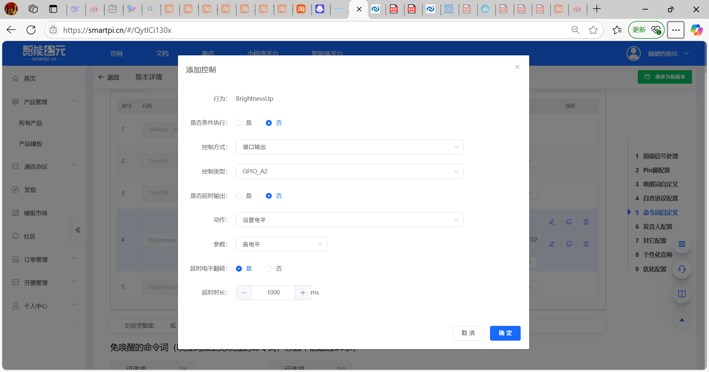
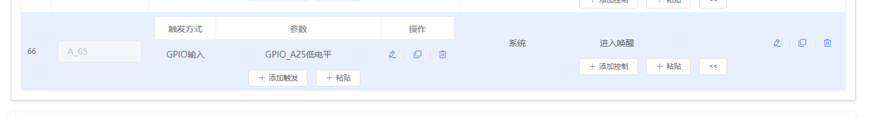
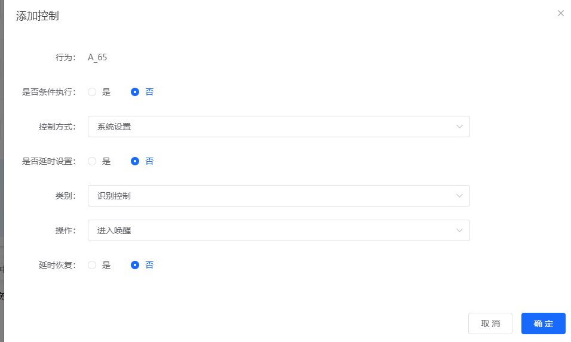

# GPIO电平翻转时间控制

## 问题描述

需要通过语音指令动态设置GPIO引脚的电平翻转时间，实现如"开1分钟"或"开2分钟"的定时控制功能。

## 解决方案

### 1. 启用延时电平翻转

在GPIO配置中启用延时翻转功能：

1. 选择需要控制的GPIO引脚
2. 开启"延时电平翻转"开关
3. 设置"延时时长"（单位：毫秒）

### 2. 使用变量控制时间

为了实现语音控制时间，需要结合变量和定时器：

**步骤1：定义时间变量**

1. 在"变量定义"中添加变量：

    - 变量名：`timing_duration`
    - 类型：`int`
    - 默认值：`0`

**步骤2：配置定时器**

1. 进入"定时器"配置页面
2. 添加新定时器，如`light_timer`
3. 设置定时器时长为变量值

**步骤3：语音命令配置**

配置语音指令与时间设置的关联：

```c
// 开灯1分钟
if (command == "开灯一分钟") {
    timing_duration = 60000;  // 60秒
    set_gpio(LIGHT_PIN, HIGH);
    start_timer();
}

// 开灯2分钟
if (command == "开灯两分钟") {
    timing_duration = 120000;  // 120秒
    set_gpio(LIGHT_PIN, HIGH);
    start_timer();
}
```

### 3. 实现方案示例

**方案一：使用定时器延时**

```c
// 定义变量
int gpio_state = 0;      // GPIO状态
int timing_duration = 0;  // 延时时长

// 开启动作
void turn_on_with_timing(int duration) {
    timing_duration = duration;
    gpio_state = 1;
    set_gpio(TARGET_PIN, HIGH);

    // 启动定时器
    start_timer("gpio_timer", duration);
}

// 定时器回调
void on_timer_expired() {
    if (gpio_state == 1) {
        set_gpio(TARGET_PIN, LOW);
        gpio_state = 0;
        timing_duration = 0;
    }
}
```

**方案二：使用系统时间判断**

```c
// 定义变量
unsigned long start_time = 0;
int active_duration = 0;

// 开启并计时
void turn_on_with_timer(int seconds) {
    active_duration = seconds * 1000;  // 转换为毫秒
    start_time = get_system_time();
    set_gpio(TARGET_PIN, HIGH);
}

// 主循环检查
void check_timing() {
    if (start_time > 0) {
        unsigned long elapsed = get_system_time() - start_time;

        if (elapsed >= active_duration) {
            set_gpio(TARGET_PIN, LOW);
            start_time = 0;
            active_duration = 0;
        }
    }
}
```

### 4. 语音时间识别

实现时间单位的语音识别：

```c
// 时间单位映射
int parse_time_unit(String unit) {
    if (unit == "秒" || unit == "秒钟") return 1000;
    if (unit == "分钟" || unit == "分") return 60000;
    if (unit == "小时" || unit == "时") return 3600000;
    return 1000;  // 默认秒
}

// 解析时间命令
void parse_time_command(String command) {
    int number = extract_number(command);
    String unit = extract_unit(command);

    int duration = number * parse_time_unit(unit);

    if (command.indexOf("开") >= 0) {
        turn_on_with_timing(duration);
    } else if (command.indexOf("关") >= 0) {
        turn_off_immediately();
    }
}
```

### 5. 配置界面操作

**基础配置：**

1. 在GPIO配置页面：

    - 勾选"延时电平翻转"
    - 设置默认延时（如200ms）

2. 在命令词配置：

    - 添加"开灯"命令
    - 添加"关灯"命令
    - 设置相应的GPIO动作

**高级配置：**

1. 使用变量设置动作：

    - 操作：变量赋值
    - 变量：timing_duration
    - 值：根据命令动态设置

2. 启动定时器：

    - 选择已定义的定时器
    - 设置时长为变量值

## 注意事项

- **时间范围**：单个定时器有最大时长限制，注意查看产品规格
- **单位转换**：确保时间单位正确转换（秒、分钟、小时）
- **状态提示**：可以通过语音反馈当前设置的时间
- **互斥控制**：避免同一个GPIO的多个定时器同时运行
- **异常处理**：定时器异常时应有恢复机制

## 常见命令示例

| 语音命令 | 执行动作 | 延时时长 |
|---------|---------|----------|
| "开灯一秒" | GPIO高电平 | 1秒 |
| "开灯三十秒" | GPIO高电平 | 30秒 |
| "开灯一分钟" | GPIO高电平 | 60秒 |
| "开灯十三秒" | GPIO高电平 | 13秒 |
| "开灯五分钟" | GPIO高电平 | 300秒 |
| "关灯" | GPIO低电平 | 立即执行 |

## 定时器详解

### 定时器的作用

定时器用于实现精确的时间控制，主要功能：

- **延时控制**：在指定时间后自动执行动作
- **计时功能**：记录动作持续的时长
- **周期执行**：按固定间隔重复执行任务

### 定时器的使用步骤

**1. 定义定时器**

在"定时器"标签页：

- 输入定时器名称（如：LBZ、light_timer）
- 点击添加定时器
- 定时器创建成功后显示在列表中

**2. 初始化定时器**

在程序启动或命令触发时：
```c
// 启动定时器
void start_timer_control() {
    // 初始化定时器
    init_timer("light_timer");

    // 设置定时器时长（可动态修改）
    set_timer_duration("light_timer", timing_duration);

    // 启动定时器
    timer_start("light_timer");
}
```

**3. 定时器回调处理**

定时器到期时自动触发：
```c
// 定时器到期回调函数
void on_timer_expired(String timer_name) {
    if (timer_name == "light_timer") {
        // 关闭设备
        set_gpio(LIGHT_PIN, LOW);

        // 可以添加语音提示
        play_tts("时间到，已关闭");

        // 停止定时器
        timer_stop("light_timer");
    }
}
```

### 实现语音控制定时时间

**核心思路：**

1. 通过语音识别提取时间数值
2. 动态设置定时器时长
3. 启动定时器执行延时控制

**完整实现：**

```c
// 时间相关变量
int target_minutes = 0;
String current_command = "";

// 语音命令解析
void process_voice_command(String command) {
    // 提取数字
    int minutes = extract_number_from_command(command);

    if (minutes > 0 && minutes <= 120) {  // 限制最大120分钟
        target_minutes = minutes;

        // 设置定时器时长（分钟转毫秒）
        int duration_ms = minutes * 60 * 1000;
        set_timer_duration("light_timer", duration_ms);

        // 执行动作并启动定时器
        if (command.indexOf("开灯") >= 0) {
            set_gpio(LIGHT_PIN, HIGH);
            timer_start("light_timer");
            play_tts("灯光已开启" + String(minutes) + "分钟");
        }
    }
}

// 数字提取函数
int extract_number_from_command(String cmd) {
    String numbers = "";
    for (int i = 0; i < cmd.length(); i++) {
        char c = cmd.charAt(i);
        if (c >= '0' && c <= '9') {
            numbers += c;
        }
    }
    return numbers.toInt();
}
```

## 配置界面说明

### 1. 定时器页面

- **定时器名称**：唯一的标识符，用于程序中引用
- **添加按钮**：创建新的定时器实例
- **列表显示**：所有已定义的定时器

### 2. 变量定义页面

- **LED**：控制灯光的开关状态
- **MEN**：控制门的开关状态
- **CHAUNG**：控制窗的开关状态

### 3. 控制详情配置

在"控制详情"标签页：

- 选择命令词（如"开灯"、"关灯"）
- 添加控制动作：

    - GPIO设置（控制硬件）
    - 变量设置（记录状态）
    - 定时器操作（延时控制）

## 注意事项

- **定时器名称必须唯一**：同一项目中不能有重名的定时器
- **时间单位转换**：注意分钟到毫秒的转换（× 60 × 1000）
- **最大时间限制**：不同型号可能有最大时长限制
- **资源管理**：不用的定时器及时停止释放资源
- **异常处理**：定时器异常时应有降级方案

**重要：周期性任务的正确配置位置**

如果需要实现周期性执行的任务（如每隔50ms发送一个命令），需要将执行动作放在"定时器超时"触发事件中，而不是定时器初始化部分：

```正确做法：
1. 在定时器标签页创建定时器（如 timer_50ms），设置超时时间50ms，选择"重复触发"模式
2. 添加一个触发事件，触发方式选择"定时器超时"，关联刚创建的定时器
3. 在该触发事件的控制详情中，添加需要周期执行的动作（如串口发送）
4. 通过语音命令或其他事件启动定时器
```

```错误做法：
× 将串口发送动作直接放在定时器初始化或启动命令中
× 在语音命令中添加循环逻辑
```


---

### 定时器如何配置上电自动启动？

**问题描述：**

需要实现定时器在设备上电后自动启动，而无需通过串口或其他外部操作进行触发。

**解决方案：**

**1. 使用上电启动系统触发**

- 在触发方式中选择"上电启动系统自动"
- 配置定时器在系统启动时自动执行
- 无需任何外部触发条件

**2. 定时器配置方法**

```
步骤1：创建定时器
- 定时器名称：如 auto_timer
- 超时时间：1000ms（或其他需要的时间）
- 执行方式：单次执行或重复执行

步骤2：设置触发条件
- 触发方式：上电启动系统自动
- 不需要配置GPIO或串口触发

步骤3：配置执行动作
- 设置需要执行的GPIO控制
- 或启动其他功能模块
```

**3. 变量控制方式**

如果需要动态控制定时器：

- 在"变量定义"中创建控制变量
- 在定时器中使用变量值
- 通过串口接收数据更新变量值

**4. 注意事项**

- 上电启动触发在系统初始化后自动执行
- 定时器启动后按设定时间执行动作
- 如需循环执行，配置为重复模式
- 确保定时器名称不与其他变量冲突

**5. 应用场景**

```
- 设备开机自检
- 自动初始化硬件状态
- 延时启动特定功能
- 定时任务自动执行
```

---

### GPIO延时参数的具体含义是什么？

**问题描述：**

在CI系列芯片的GPIO控制配置中，延时参数1000ms的具体含义是指IO口在1秒后变为高电平，还是指IO口立即变为高电平并在1秒后反转为低电平？

**解决方案：**

**延时参数说明：**

延时参数指的是**IO口立即变为高电平，并在指定延时后自动反转为低电平**。

**工作原理：**

1. **立即动作**：

    - 触发条件满足时，GPIO立即变为设定的电平（如高电平）
    - 不存在延迟动作的情况

2. **延时翻转**：

    - 从动作开始计时
    - 达到设定的延时时间后自动翻转电平
    - 高电平自动变为低电平，或反之

**示例说明：**

配置GPIO_A2，设置高电平，延时1000ms：

```
时间轴：
0ms      : 触发条件满足 → GPIO_A2立即变为高电平
0-1000ms: GPIO_A2保持高电平状态
1000ms   : 延时到达 → GPIO_A2自动翻转为低电平
```

**配置要点：**

- **动作设置**：设置初始电平状态（高电平/低电平）
- **延时电平翻转**：必须勾选此选项才能启用延时功能
- **延时时间**：设定翻转的时间间隔（单位：毫秒）

**应用场景：**

- **脉冲控制**：产生固定宽度的脉冲信号
- **暂时动作**：设备开启一段时间后自动关闭
- **时序控制**：配合其他动作实现复杂时序

**注意事项：**

- 延时时间范围需查看具体型号的规格限制
- 如需持续保持电平，不要勾选"延时电平翻转"
- 延时精度为毫秒级，适合大多数控制场景
- 翻转动作是自动的，不需要额外触发

---

### GPIO延时参数的具体含义是什么？

**问题描述：**

在CI系列芯片的GPIO控制配置中，延时参数1000ms的具体含义是指IO口在1秒后变为高电平，还是指IO口立即变为高电平并在1秒后反转为低电平？

**解决方案：**

**延时参数说明：**

延时参数指的是**IO口立即变为高电平，并在指定延时后自动反转为低电平**。

**工作原理：**

1. **立即动作**：

    - 触发条件满足时，GPIO立即变为设定的电平（如高电平）
    - 不存在延迟动作的情况

2. **延时翻转**：

    - 从动作开始计时
    - 达到设定的延时时间后自动翻转电平
    - 高电平自动变为低电平，或反之

**示例说明：**

配置GPIO_A2，设置高电平，延时1000ms：

```
时间轴：
0ms      : 触发条件满足 → GPIO_A2立即变为高电平
0-1000ms: GPIO_A2保持高电平状态
1000ms   : 延时到达 → GPIO_A2自动翻转为低电平
```

**配置要点：**

- **动作设置**：设置初始电平状态（高电平/低电平）
- **延时电平翻转**：必须勾选此选项才能启用延时功能
- **延时时间**：设定翻转的时间间隔（单位：毫秒）

**应用场景：**

- **脉冲控制**：产生固定宽度的脉冲信号
- **暂时动作**：设备开启一段时间后自动关闭
- **时序控制**：配合其他动作实现复杂时序

**注意事项：**

- 延时时间范围需查看具体型号的规格限制
- 如需持续保持电平，不要勾选"延时电平翻转"
- 延时精度为毫秒级，适合大多数控制场景
- 翻转动作是自动的，不需要额外触发



---

### 如何配置定时器实现语音指令联动控制？

**问题描述：**

需要通过语音指令触发后，经过指定时间自动执行另一个控制动作（如：语音打开第一路后，5秒后自动启动第二路）。

**解决方案：**

**方案一：使用定时器+跳转行为**

步骤1：创建定时器

1. 进入"定时器"配置页面
2. 添加新定时器，命名为`timer1`（或其他名称）
3. 设置定时器超时时间（如5000ms表示5秒）

步骤2：配置语音指令

1. 在语音指令中添加"启动定时器"的系统动作
2. 参数选择刚创建的定时器（如timer1）
3. 设置超时时间（如10000ms）

步骤3：设置定时器超时事件

1. 创建新的事件触发，触发方式选择"定时器超时"
2. 选择对应的定时器（如timer1定时器超时）
3. 添加"跳转行为"，目标设置为需要执行的动作命令

步骤4：配置跳转到的动作

1. 在跳转目标命令中配置具体的GPIO控制
2. 设置GPIO端口和电平状态
3. 可添加播报提示

**方案二：使用延时触发**

1. 在控制动作中直接设置延时参数
2. 启用"延时电平翻转"功能
3. 设置延时时间，到达后自动翻转电平

**配置示例：**

实现"打开台灯"10秒后自动关闭：

1. 配置"打开台灯"指令
2. 添加"启动定时器"动作，选择timer1，超时10000ms
3. 创建timer1超时事件
4. 设置跳转到"关闭台灯"命令
5. 配置"关闭台灯"的GPIO控制动作

**注意事项：**

- 定时器名称必须唯一，不能重复
- 跳转行为需要明确指定目标命令
- 确保跳转到的命令已正确配置控制动作
- 可通过添加播报验证跳转是否成功执行


---

### 如何配置定时器超时事件和跳转行为？

**问题描述：**

需要设置定时器超时后自动执行特定动作，并通过跳转行为实现流程控制。

**解决方案：**

**步骤1：创建定时器**

1. 进入"定时器"配置页面
2. 点击"添加定时器"
3. 输入定时器名称（如timer1）
4. 设置超时时间（根据需要设定）

**步骤2：配置定时器超时事件**

1. 在事件触发中添加新事件
2. 触发方式选择"事件触发"
3. 触发条件选择"timer1定时器超时"
4. 添加控制动作

**步骤3：设置跳转行为**

1. 控制方式选择"跳转行为"
2. 类别选择"流程控制"
3. 操作选择"跳转行为"
4. 目标行为选择需要跳转到的命令

**步骤4：配置目标动作**

在跳转到的命令中：

1. 添加具体的GPIO控制动作
2. 设置端口输出（高电平/低电平）
3. 可添加延时参数
4. 可添加播报提示

**配置示例：**

实现延时10秒后关闭设备：

1. 创建定时器timer1，超时10000ms
2. 配置timer1超时事件
3. 设置跳转到"关闭设备"命令
4. 在"关闭设备"中配置GPIO为低电平

**注意事项：**

- 定时器名称必须与超时事件中的选择一致
- 跳转行为的目标必须是已定义的命令
- 可通过添加播报验证跳转是否成功
- 支持可打断和不可打断两种模式


---

## 如何通过IO口实现模块间唤醒？

**问题描述：**

需要实现模块A识别唤醒词后，通过IO口唤醒模块B，且模块B被唤醒时不产生播报音。

**解决方案：**

### 1. 模块B配置

**GPIO输入配置**：

1. 在模块B的平台配置中，选择一个GPIO引脚（如A_65）
2. 设置引脚功能为"GPIO输入"
3. 配置触发方式为"低电平触发"

**添加控制**：

1. 在"添加控制"页面配置唤醒动作
2. 触发条件：GPIO检测到低电平
3. 操作类型：选择"进入唤醒"
4. 不添加播报操作，直接进入唤醒状态

### 2. 模块A配置

**GPIO输出配置**：

1. 在模块A识别到唤醒词后
2. 配置GPIO输出为低电平
3. 保持足够的低电平时间确保模块B检测到

### 3. 硬件连接

- 将模块A的GPIO输出引脚连接到模块B的GPIO输入引脚
- 确保共地连接
- 建议使用10kΩ上拉电阻

**注意事项**：

- IO触发唤醒不会产生播报音，直接进入唤醒状态
- 低电平脉宽建议大于100ms确保可靠触发
- 除IO触发外，也可使用串口触发唤醒
- 触发电平可根据实际需求选择高电平或低电平



