# 串口输入参数配置

## 问题描述

需要了解串口输入触发行为中"输入参数"配置的作用，以及如何通过传入的参数值来控制行为执行。

## 功能说明

### 输入参数的作用

输入参数功能允许在串口输入触发时解析传入的数据，并根据参数值执行不同的逻辑。这样可以实现：

- **数据解析**：从串口数据中提取特定参数
- **条件判断**：根据参数值执行不同操作
- **灵活控制**：实现更复杂的串口控制逻辑

### 配置界面说明

**参数配置区域包含：**

- **参数名**：定义参数的名称，用于后续引用
- **类型**：支持char、int、float等数据类型
- **测试值**：用于生成测试消息的参数值

## 配置步骤

### 1. 添加串口输入触发

1. 在平台中选择"串口输入"触发方式
2. 选择对应的串口（如UART1_RX）
3. 设置消息编号（如69）

### 2. 配置输入参数

1. 点击"输入参数"区域
2. 添加参数：

    - 参数名：如"warning"
    - 类型：选择"char"
    - 测试值：设置为"0"

### 3. 测试消息生成

- 系统自动根据参数配置生成测试消息
- 格式示例：`AA 55 45 00 55 AA`
- 其中`45`是消息标识，`00`是参数值

## 使用方法

### 1. 参数触发条件

可以在控制逻辑中设置条件判断：

```javascript
// 示例：根据warning参数值执行不同动作
if (warning == '0') {
    // 执行动作A
} else if (warning == '1') {
    // 执行动作B
}
```

### 2. 串口数据格式

发送数据时需按约定格式：

```
AA 55 [消息ID] [参数值] 55 AA
```

- `AA 55`：帧头（固定）
- `[消息ID]`：对应配置的消息编号
- `[参数值]`：要传递的参数数据
- `55 AA`：帧尾（固定）

### 3. 多参数配置

支持配置多个参数：

- 可以添加多个输入参数
- 每个参数有独立的名称和类型
- 测试消息会包含所有参数

## 实际应用示例

### 示例1：设备状态控制

```json
{
  "parameter_name": "device_status",
  "type": "int",
  "test_value": "1"
}
```

发送数据：`AA 55 45 01 55 AA`
表示设备状态为1（如运行中）

### 示例2：告警级别配置

```json
{
  "parameter_name": "alert_level",
  "type": "char",
  "test_value": "2"
}
```

发送数据：`AA 55 45 02 55 AA`
表示告警级别为2（如中等告警）

## 注意事项

1. **参数类型匹配**
    - 确保发送的数据类型与配置一致
    - char类型发送单个字符
    - int类型发送整数

2. **测试消息使用**
    - 测试消息用于调试和验证
    - 修改测试值会自动更新测试消息
    - 实际应用需按格式发送

3. **数据格式要求**
    - 必须包含正确的帧头帧尾
    - 参数值位置和长度要准确
    - 建议使用十六进制格式

## 常见问题

### JSON数据包解析配置失败

**问题描述：**

在使用"通讯输入"触发方式解析心知平台返回的天气数据时，配置检查失败，提示"变量设置的串口参数类型不匹配"。

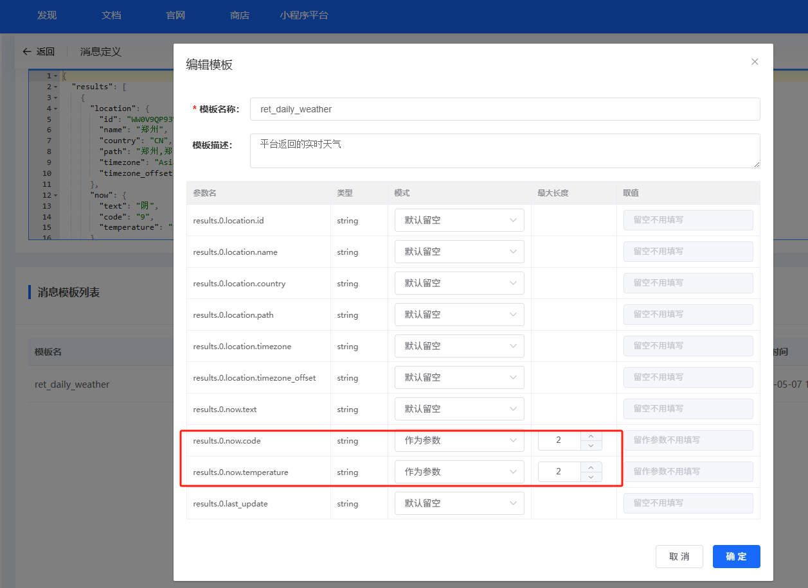

**解决方案：**

1. **检查参数配置**
    - 确认JSON模板中解析的参数名正确
    - 验证参数路径（如 `results.0.now.code`）与实际数据结构匹配

2. **修正参数类型**

### 平台配置中变量重复读取问题

**问题描述：**

在平台配置中，当单片机通过串口发送多个变量时，平台在读取这些变量时出现重复读取的问题，导致播报内容中前两个变量被重复读取，而后续变量正常。

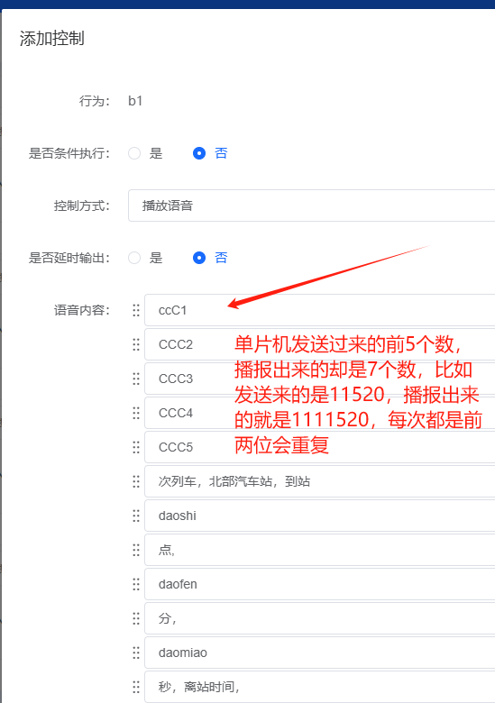

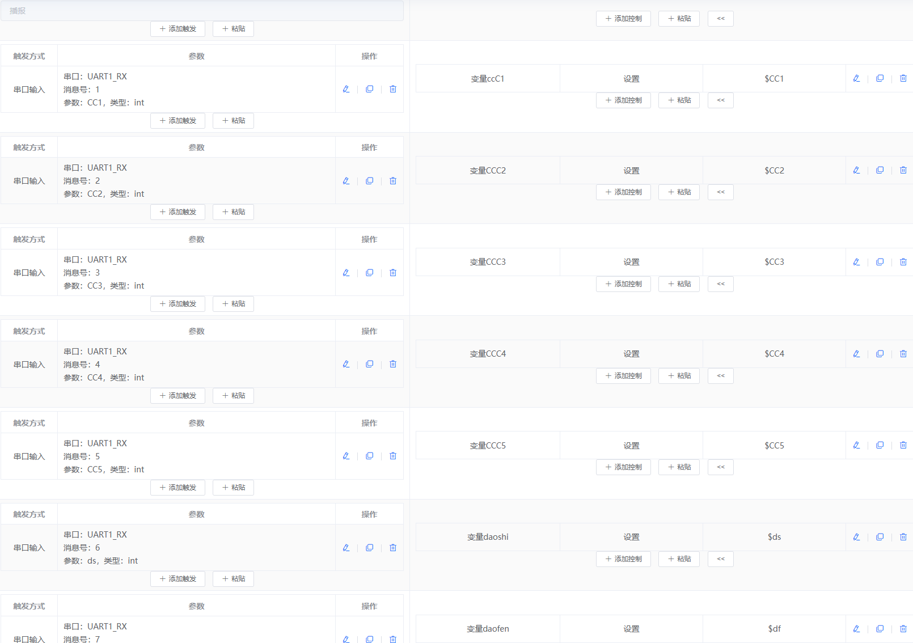

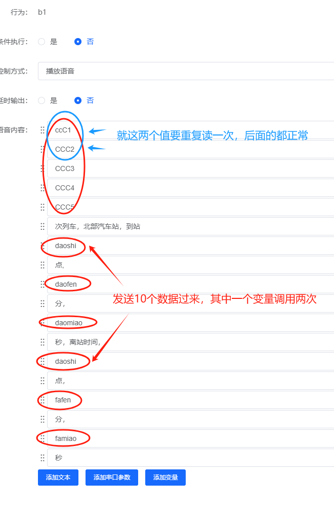

**解决方案：**

**问题分析**

- 问题出现在播报内容的变量调用逻辑中
- ccC1和ccC2这两个变量被重复读取一次
- 后续变量（ccC3、ccC4、ccC5）正常读取
- 某些情况下daoshi变量也会被重复调用

**排查步骤**

1. **单独测试问题变量**
    - 在平台中单独测试有问题的变量值
    - 确认变量本身是否包含异常数据

2. **检查播报内容配置**
    - 查看播报内容中变量的引用次数
    - 确认是否在播报文本中重复引用了同一变量

3. **验证串口数据格式**
    - 检查单片机发送的数据格式是否正确
    - 确认每个变量只发送了一次

**解决建议**

- 仔细检查播报文本编辑器中的变量引用
- 使用"清除"功能重新编辑播报内容
- 如果问题持续，尝试删除后重新添加整个播报配置

**注意事项：**

- 通常是配置错误导致的重复引用，而非平台bug
- 建议在编辑播报内容时仔细核对变量列表
- 保存配置前使用预览功能确认播报内容正确

---
    - 在触发配置中，确保参数类型与实际数据类型一致
    - 数值型数据应选择int类型，而非string类型

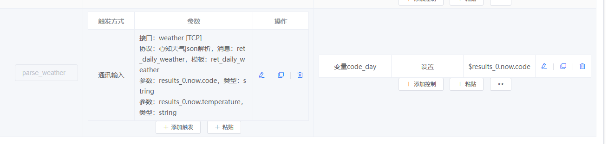

3. **重新配置触发**
    - 删除原有触发配置
    - 重新添加触发，选择正确的参数类型
    - 保存并检查配置

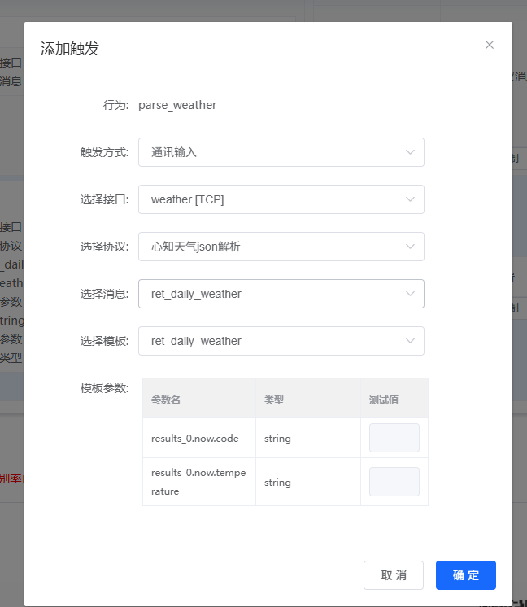

**注意事项：**

- JSON数据包解析时，参数名中的点号(.)会自动转换为下划线(_)
- 确保通讯输入的参数名与JSON模板解析的参数名完全一致
- 配置检查失败时会明确提示哪个参数类型不匹配

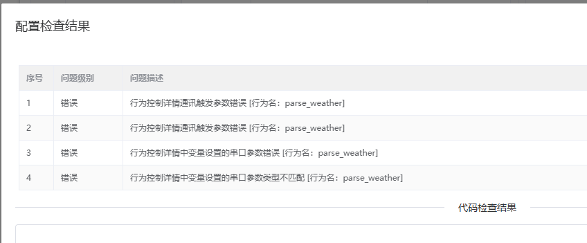

### JSON文件导入失败怎么办？

**问题描述：**

导入JSON文件时提示"文件格式非法，导入产品失败"。

**解决方案：**

1. **导出并重新保存JSON文件**
    - 从平台导出配置文件
    - 使用文本编辑器打开并保存
    - 确保文件格式正确

2. **检查文件内容格式**
    - 确认JSON格式语法正确
    - 检查是否有遗漏的逗号或括号
    - 验证编码格式为UTF-8


3. **重新导入文件**
    - 保存后的文件大小应该变化
    - 重新选择文件导入
    - 确认导入成功

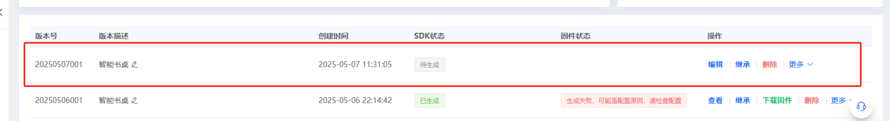

**注意事项：**

- 平台导出的文件可能存在格式问题
- 建议使用专业JSON编辑器检查格式
- 导入前先备份原始配置

### 如何配置UART1_TX端口输出控制？

**问题描述：**

需要通过UART1_TX端口发送数据，配置控制方式为"端口输出"后，需要了解具体的参数设置方法。

**解决方案：**

**1. 配置步骤**

- 在"添加控制"界面选择行为名称（如wakeup_uni）
- 控制方式选择"端口输出"
- 控制类型选择"UART1_TX"
- 动作设置为"发送"
- 参数设置为需要发送的数据（如28）

**2. 数据格式说明**

- UART1_TX支持发送十六进制数据
- 参数值可以是单个字节或多个字节
- 发送的数据会直接通过UART1_TX引脚输出

**注意事项：**

- 确保UART1_TX引脚已正确连接到接收设备
- 波特率等串口参数需要在模块初始化时配置
- 测试时可使用示波器或串口调试助手验证输出

---

### CI-03T定时器资源使用完毕，如何优化配置或增加定时器数量？

**问题描述：**

CI-03T模块的定时器资源已经全部使用完毕，需要了解如何优化现有配置或增加更多定时器资源。

**解决方案：**

**定时器资源分析：**

1. **CI-03T定时器限制**：

    - 定时器数量有限
    - 资源紧张影响功能扩展
    - 需要合理规划和优化

2. **资源占用情况**：

    - 每个定时器占用系统资源
    - 复杂定时逻辑消耗更多资源
    - 长时间定时占用时间更久

**优化配置方法：**

1. **精确定时逻辑**：

    - 合并功能相似的定时器
    - 使用计数器替代简单定时
    - 减少不必要的延时操作

2. **提高资源利用率**：

    ```
    // 优化前
    timer1_set(1000);  // 1秒延时
    timer2_set(2000);  // 2秒延时
    timer3_set(3000);  // 3秒延时

    // 优化后
    counter = 0;
    on_timer_event() {
        counter++;
        if (counter == 1) do_action1();
        if (counter == 2) do_action2();
        if (counter == 3) do_action3();
        reset_timer();
    }
    ```

3. **分时复用策略**：

    - 短时间定时可循环使用
    - 避免同时启动多个长定时器
    - 使用状态机管理定时序列

**增加定时器方案：**

1. **使用软件定时器**：

    - 基于系统时钟的软件定时
    - 占用较少硬件资源
    - 可实现多个虚拟定时器

2. **外部定时芯片**：

    - 使用专用定时芯片（如555）
    - 通过IO接口控制
    - 不占用模块内部定时资源

3. **功能集成优化**：

    - 将定时功能集成到主控制逻辑
    - 减少独立的定时需求
    - 使用事件触发替代定时触发

**配置建议：**

1. **优先级管理**：

    - 核心功能使用硬件定时器
    - 次要功能使用软件定时
    - 避免资源冲突

2. **性能平衡**：

    - 定时精度要求高的用硬件定时
    - 精度要求不高的用软件定时
    - 根据实际需求选择

**实施步骤：**

1. **梳理现有定时需求**
2. **识别可优化的配置**
3. **选择合适的优化方案**
4. **测试验证优化效果**
5. **更新固件配置**

**注意事项：**

- 定时器优化需要充分测试
- 确保时序逻辑正确性
- 考虑系统整体资源分配
- 保留原有功能作为备份方案

---

### 串口触发消息编号重复如何处理？

**问题描述：**

在使用串口作为事件触发方式时，多个不同的串口数据包具有相同的前导字节和消息编号，导致配置时提示"消息号重复"错误。

**解决方案：**

**1. 消息编号冲突处理方法**

- **修改主控发送数据**（推荐）：

    - 如果可能，优先修改主控发送的数据格式
    - 为不同类型的数据分配不同的消息编号
    - 这是最简单直接的解决方案

- **创建多个串口触发**：

    - 每个不同的消息编号创建一个串口触发
    - 将具有相同编号的数据分别处理
    - 在后续逻辑中根据数据内容区分处理

**2. 数据格式优化建议**

- **使用前缀区分**：
    ```
    数据1：7F C0 XX XX XX XX
    数据2：7F 80 XX XX XX XX
    数据3：7F 81 XX XX XX XX
    ```
    使用第二个字节作为消息编号区分

- **构造统一数据结构**：
    ```
    帧头：4字节固定（如7F C0 FF FF）
    消息号：1字节（0x00表示不同类型）
    数据内容：可变长度
    ```

**3. 参数配置技巧**

- **添加参数不进行判断**：

    - 配置输入参数时填写测试值
    - 在控制逻辑中不判断该参数值
    - 只判断需要区分的关键字节

- **使用变量存储**：

    - 将串口接收的参数赋值给变量
    - 通过条件判断变量值执行不同逻辑
    - 实现灵活的数据处理

**4. 实施示例**

对于以下三组数据：
```
数据A：7F C0 FF FF 00 80 BD 7F
数据B：7F C0 FF FF 00 00 3D 7F
数据C：7F 80 01 00 26 01 27 7E
```

处理方案：

- 数据A和B：使用第五个字节作为区分（0x80 vs 0x00）
- 数据C：使用第二个字节区分（0x80 vs 0xC0）
- 创建两个触发：消息号0xC0和消息号0x80

**注意事项：**

- 消息编号在同一个触发行为中必须唯一
- 测试值仅用于生成测试消息，不影响实际触发
- 建议在主控端优化数据格式，避免复杂的处理逻辑
- 可以联系系统管理员了解是否有更灵活的配置方案

---

### 串口触发时不判断输入参数的测试值如何实现？

**问题描述：**

在串口触发配置中，当多个不同含义的串口数据包具有相同的前导字节（如帧头）和消息编号时，如何避免因消息编号重复导致的配置错误，并实现对不同数据包的正确区分与处理。

**解决方案：**

**1. 测试值的作用说明**

测试值在串口触发配置中仅用于以下目的：

- **生成测试消息**：系统根据配置生成格式化的测试数据
- **不影响实际触发**：实际触发时不检查测试值
- **方便调试验证**：用于测试和验证配置正确性

**2. 不判断测试值的配置方法**

- **填写测试值**：

    - 每个参数都需要填写测试值（即使不参与判断）
    - 测试值可以是任意合法值
    - 例如：v1=25, v2=25, v3=0

- **判断关键字节**：

    - 在控制逻辑中只判断需要区分的关键字节
    - 其他参数仅用于数据结构构造

- **配置示例**：
    ```
    串口数据：7F C0 FF FF XX XX XX
    参数配置：

    - v1: 测试值25（不判断）
    - v2: 测试值25（不判断）
    - v3: 测试值0，作为消息号（判断）
    ```

**3. 处理多种数据包的方法**

- **方法一：使用不同的消息号**
    - 修改主控发送数据，使用不同的消息号
    - 7F C0 FF FF 01 XX XX（消息号01）
    - 7F C0 FF FF 02 XX XX（消息号02）

- **方法二：使用前缀区分**
    - 使用第二个字节作为区分标识
    - 7F C0 XX XX XX XX（C0系列）
    - 7F 80 XX XX XX XX（80系列）

- **方法三：构造统一数据结构**
    ```
    帧头：4字节（7F C0 FF FF）
    消息号：1字节（区分不同类型）
    数据内容：可变长度
    ```

**4. 实际应用示例**

对于需要处理的数据：
```
数据A：7F C0 FF FF 00 80 BD 7F  （心跳包）
数据B：7F C0 FF FF 00 00 3D 7F  （状态包）
数据C：7F 80 01 00 26 01 27 7E  （指令包）
```

配置方案：

- 创建两个串口触发：消息号0xC0和消息号0x80
- 0xC0触发处理心跳和状态（通过第五字节区分）
- 0x80触发处理指令包

**注意事项：**

- 测试值必须填写，但可以选择不参与判断
- 关键是要明确哪些字节用于区分不同数据包

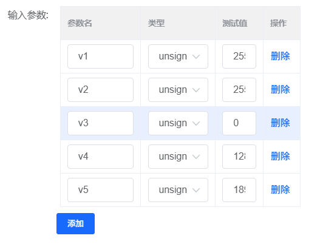
- 建议在主控端优化数据格式，减少处理复杂度
- 可以使用变量存储解析出的参数，便于后续处理

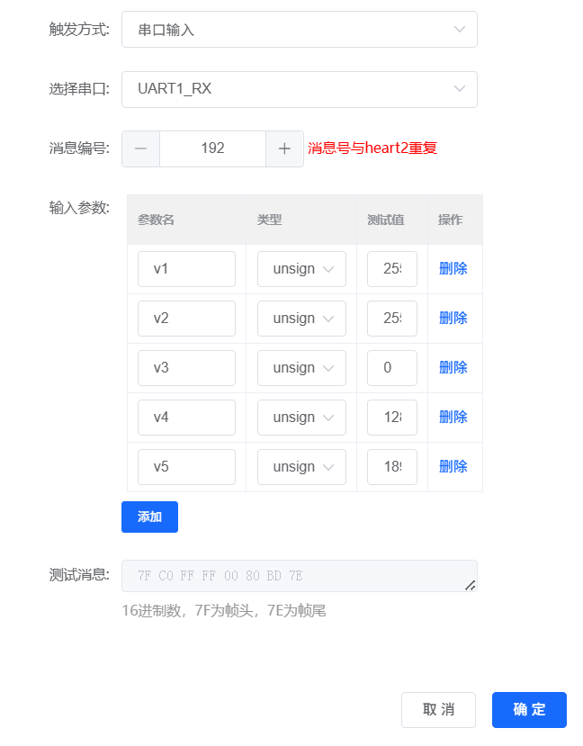

---

### 串口通信中double类型参数如何编码？

**问题描述：**

在串口通信中配置double类型参数时，数值1被编码为`00 00 00 00 00 00 F0 3F`，数值2被编码为`00 00 00 00 00 00 00 40`，不理解这种编码方式。

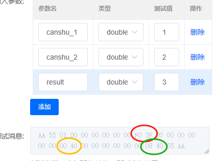

**解决方案：**

**1. IEEE 754浮点数编码标准**

double类型采用IEEE 754标准的64位（8字节）双精度浮点数格式：

- **符号位**：1位（最高位），0表示正数，1表示负数
- **指数位**：11位，用于表示数值的范围
- **尾数位**：52位，用于表示数值的精度

**2. 具体编码示例**

以数值1为例：
```
完整编码：00 00 00 00 00 00 F0 3F
二进制表示：00000000 00000000 00000000 00000000 00000000 00000000 11110000 00111111
解析：

- 符号位：0（正数）
- 指数位：1023（偏移量，实际指数为0）
- 尾数位：1.0（隐含的1）
```

以数值2为例：
```
完整编码：00 00 00 00 00 00 00 40
二进制表示：00000000 00000000 00000000 00000000 00000000 00000000 00000000 01000000
解析：

- 符号位：0（正数）
- 指数位：1024（偏移量，实际指数为1）
- 尾数位：1.0（隐含的1）
```

**3. 实际应用建议**

由于double类型编码复杂，不便于直观理解和调试：

- **推荐使用int类型**：对于整数参数，使用int类型更直观
- **推荐使用unsigned char类型**：对于单个字节参数，更易理解
- **如必须使用double**：建议在发送端将浮点数转换为整数部分和小数部分分别发送

**4. 替代方案**

```c
// 方案1：将浮点数转为整数发送
float value = 1.25;
int int_part = (int)value;        // 1
int decimal_part = (int)((value - int_part) * 100);  // 25

// 分别发送整数和小数部分
send_data(int_part);      // 发送 1
send_data(decimal_part);  // 发送 25
```

```c
// 方案2：使用固定长度字符串
float value = 1.25;
char str_value[10];
sprintf(str_value, "%.2f", value);  // "1.25"
// 发送字符串 "1.25"
```

**注意事项：**

- double类型占8个字节，会增加通信开销
- 浮点数的精度问题可能导致接收端解析错误
- 调试时建议使用在线IEEE 754转换工具验证编码结果
- 对于简单的数值传输，建议避免使用double类型

---

### 语音识别的数字能否动态转换为UART数据帧？

**问题描述：**

是否可以通过语音识别将数字（如"一百二十五"）转换为UART发送的特定格式数据帧（帧头 + 消息号 + 数字 + 帧尾）。


**解决方案：**

**1. 平台限制说明**

当前平台不支持将语音识别的数字动态转换为UART数据帧：

- **输出内容固定**：UART端口输出只能发送预设的固定参数
- **不支持动态转换**：无法将语音识别的实时结果动态插入到数据帧中
- **参数需预设**：所有UART输出参数必须在配置时预先设定

**2. 当前配置方式**

UART端口输出配置流程：

1. **控制方式**：选择"端口输出"
2. **控制类型**：选择"UART1_TX"
3. **参数设置**：手动输入固定的十六进制值（如7D）
4. **数据格式**：

    - 支持十六进制格式（0-9，A-F）
    - 最大长度32字节
    - 两个字符一组，中间用空格分隔（如：98 A3 0B FE）

**3. 替代实现方案**

**方案一：使用预设命令组合**

- 为常用数字预设多个UART输出命令
- 通过识别不同的语音指令触发对应的预设命令
- 示例：

    - "命令一百二十五" → 发送预设的数据帧A
    - "命令二百" → 发送预设的数据帧B

**方案二：分段控制**

- 将数据帧拆分为多个部分
- 语音控制各个部分的选择
- 示例：
    ```
    帧头：固定发送
    消息号：通过语音选择（消息1/消息2/消息3）
    数据部分：通过语音选择数值对应的预设值
    帧尾：固定发送
    ```

**方案三：使用外部控制器**

- 语音模块发送简单指令给外部MCU
- 由MCU根据指令组装完整的数据帧
- 实现更灵活的数据处理

**4. 配置示例**

```
语音指令："发送状态1"
触发动作：UART1_TX发送
发送内容：AA 55 01 01 55 AA  （帧头+消息号01+数据01+帧尾）

语音指令："发送状态2"
触发动作：UART1_TX发送
发送内容：AA 55 01 02 55 AA  （帧头+消息号01+数据02+帧尾）
```

**注意事项：**

- 平台目前不支持语音内容的实时解析和转换
- 所有UART输出必须预先配置好完整的数据内容
- 如需动态数据传输，考虑使用串口输入触发方式
- 可以联系技术支持了解是否有更灵活的解决方案

---

### 语音指令与IO口控制配置如何定义？

**问题描述：**

在配置语音指令与IO口控制时，需要明确如何定义驱动播报指令的排序，以及是否需要添加默认的播报音。

**解决方案：**

**播报驱动指令排序规则：**

播报驱动指令按照1~18的顺序进行分组排序：

- **模式1~6**：播报1-6对应模式相关的语音指令
- **开关7~12**：播报7-12对应开关控制相关的语音指令
- **开关倒计时13~18**：播报13-18对应倒计时功能相关的语音指令

**IO口控制要求：**

- **IO10-IO8**：支持脉冲输出时间配置（如500ms）
- **输出类型**：

    - 高脉冲输出（需要学习功能）
    - 低脉冲输入
- **初始状态**：

    - 初始低电
    - 初始高电

**关于默认播报音：**

- 播报音的具体用途需要根据实际应用场景确定
- 驱动指令通过涂鸦的一键执行调用串口码
- 执行的是自定义的文字转语音内容


**注意事项：**

- 总共可调用10只IO脚进行控制
- 播报内容需要根据实际应用需求自定义
- 配置时注意IO口的初始电平状态

---

### 播报驱动指令与自定义语音如何匹配？

**问题描述：**

需要了解如何将自定义的语音播报与驱动指令进行匹配，并确认播报音频的用途和配置方式。

**解决方案：**

**播报指令与驱动指令的映射关系：**

- **播报1-9**：对应微信小程序转蓝牙发射的18条文字转语音播报
- **播报10-18**：对应APP后台的18条驱动指令

**配置机制：**

- **驱动指令**：涂鸦平台的一键执行功能调用对应的串口码
- **播报内容**：执行的是自定义的文字转语音（文件栈）
- **数量对应**：18条驱动指令对应18条自定义文字转语音

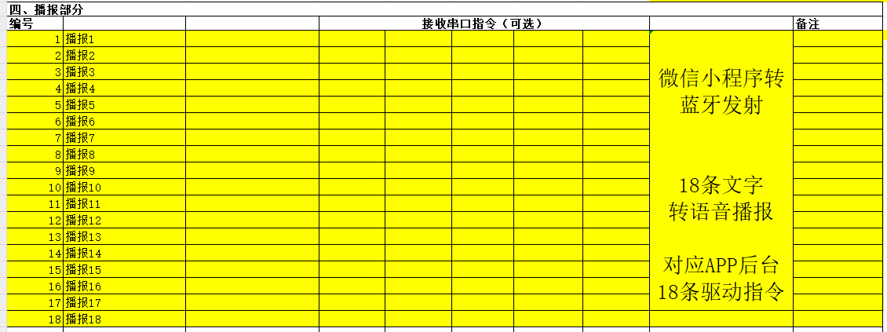

**配置流程：**

1. **定义播报内容**：根据需求自定义18条播报文本
2. **生成语音文件**：将文本转换为语音文件
3. **配置驱动指令**：在APP后台设置对应的18条驱动指令
4. **建立映射关系**：将播报编号与驱动指令一一对应

**注意事项：**

- 测试阶段可以先使用临时播报音频进行验证
- 后续可以根据实际需求修改播报内容
- 确保播报编号与驱动指令编号严格对应

---

### 涂鸦模组网络状态查询为什么需要连续发送6次？

**问题描述：**

在添加设备过程中，系统会连续6次发送查询指令检查涂鸦模组的网络状态，询问是否可以改为只发送一次。

**解决方案：**

**连续查询的必要性：**

连续6次查询涂鸦模组网络状态是系统设计的**刚需要求**，不能简化为单次查询。

**网络状态编码说明：**

- **01**：已入网
- **02**：网络异常
- **03**：配网中
- **00**：未入网

**查询机制：**

1. **触发时机**：设备进入配网模式后自动启动
2. **查询频率**：连续发送6次查询指令
3. **查询方向**：ASR06FM → 涂鸦模组
4. **目的**：确保获取到准确、稳定的网络状态


**技术原因：**

- **网络稳定性**：无线网络状态可能快速变化，多次查询确保准确性
- **通信可靠性**：避免单次查询因通信失败导致状态误判
- **同步机制**：确保主控与模组之间的状态同步

**注意事项：**

- 连续6次查询是底层协议的固定要求，不建议修改
- 如需了解具体实现细节，需要咨询固件开发工程师
- 系统会在获取到有效状态后进行相应处理

---

### 大模型模块如何通过网络配网？

**问题描述：**

需要了解大模型模块的Wi-Fi和蓝牙是通过什么方式触发添加到网络的。

**解决方案：**

大模型模块采用**蓝牙配网**的方式添加到网络。

**配网流程：**

1. **启动配网模式**：

    - 模块上电后自动进入待配网状态
    - 或通过特定指令触发配网模式

2. **蓝牙连接建立**：

    - 手机APP通过蓝牙搜索并连接模块
    - 建立蓝牙通信链路

3. **网络信息传输**：

    - 通过蓝牙通道传输Wi-Fi网络信息
    - 包括SSID、密码等认证信息

4. **网络连接**：

    - 模块接收网络信息后连接Wi-Fi
    - 成功后返回连接状态确认

**技术特点：**

- **便捷性**：用户无需通过串口或其他方式配置网络
- **安全性**：蓝牙近距离传输，确保信息安全
- **通用性**：支持主流的Wi-Fi网络加密方式

**注意事项：**

- 配网前确保手机蓝牙已开启
- 配网过程中手机与模块距离不宜过远
- 网络信息传输需要时间，请耐心等待连接确认
---

### 如何配置大量参数控制多个命令的开关状态？

**问题描述：**

需要通过串口发送128个字节的数据，控制128个命令的开启与关闭状态，不确定配置方法是否正确。

**解决方案：**

可以通过配置多个输入参数来实现对大量命令的控制：

**1. 参数配置方法**

- 添加128个参数（如Floor1-Floor128）
- 每个参数类型设置为char（1字节）
- 测试值可设置为任意值（仅用于测试）

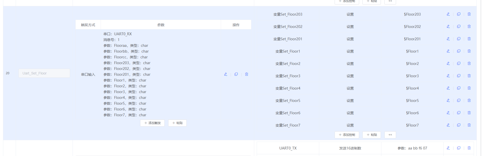

**2. 控制逻辑实现**

每个参数对应一个命令的开关状态：

- 参数值为非0：命令开启
- 参数值为0：命令关闭

**3. 测试值说明**

测试值的作用：

- **生成测试消息**：系统根据配置生成格式化的测试数据
- **不影响实际触发**：实际运行时以接收到的串口数据为准
- **方便调试验证**：用于测试配置的正确性

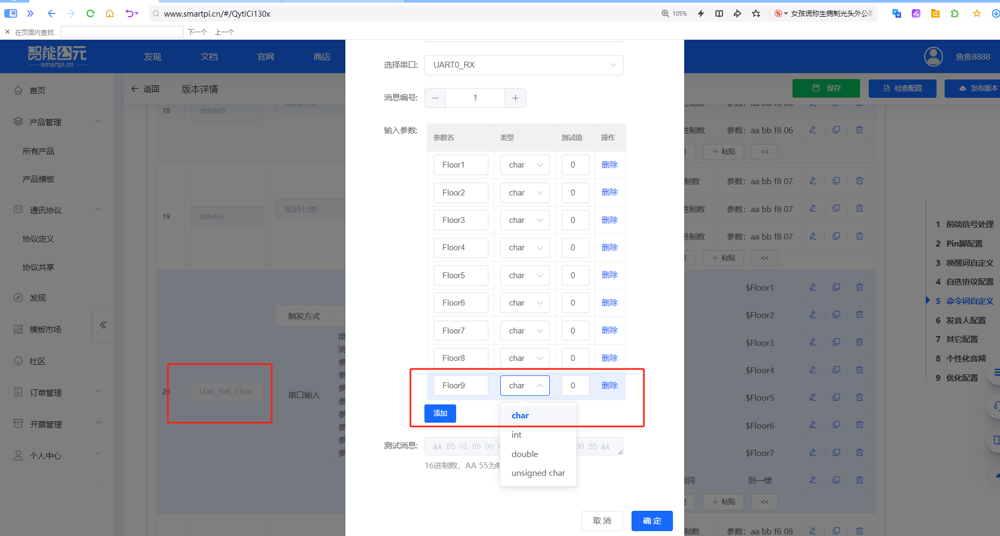

**4. 数据格式示例**

串口发送数据格式：
```
[字节1][字节2]...[字节128]
    0      1          127/128
```
- 每个字节控制一个命令
- 0表示关闭，非0表示开启

**注意事项：**

- 测试值在实际使用中没有意义，仅用于生成测试消息
- 确保参数数量与需要控制的命令数量一致
- 大量参数配置时建议分批保存，避免配置丢失
- 实际应用中严格按照约定的数据格式发送串口数据

---


### SU-03T串口输入格式中的16进制数据如何配置？

**问题描述：**

在SU-03T模块的串口输入配置中，需要在"输入字符"字段填写16进制数据（如2B 4F 4B），不确定如何正确配置。

**解决方案：**

**1. 配置界面说明**

串口输入格式配置界面包含以下要素：

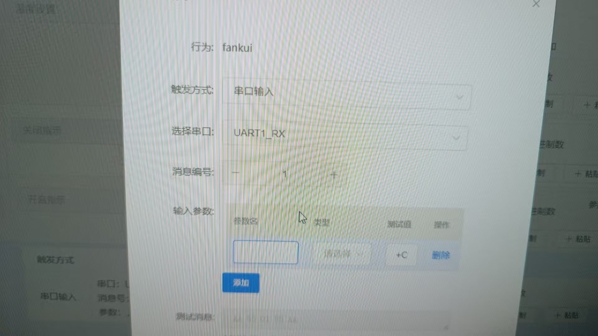

- **行为**：定义该配置关联的行为名称
- **触发方式**：选择"串口输入"
- **选择串口**：指定监听的串口（如UART1_RX）
- **消息编号**：用于区分不同消息类型的编号
- **输入参数**：配置具体的参数规则

**2. 16进制数据格式填写**

对于输入字符的16进制数据（如2B 4F 4B）：

- **格式要求**：

    - 使用空格分隔的16进制值
    - 每个值为2位十六进制数（00-FF）
    - 示例：`2B 4F 4B`

- **实际表示**：

    - `2B` = ASCII字符 '+'
    - `4F` = ASCII字符 'O'
    - `4B` = ASCII字符 'K'
    - 组合起来为 "+OK"

**3. 配置步骤**

1. 在平台中创建串口输入触发
2. 选择对应的串口（UART1_RX）
3. 设置消息编号（如1）
4. 在输入参数区域配置：

    - 参数名：自定义名称
    - 类型：选择合适的数据类型
    - 测试值：用于生成测试消息

**4. 数据接收验证**

系统会根据配置自动识别数据格式：

- 支持固定字节格式检测
- 可以配置特定字符序列作为触发条件
- 测试功能帮助验证配置正确性

**注意事项：**

- 16进制值不区分大小写
- 确保数据格式与发送端一致
- 建议使用示波器或串口调试助手验证实际数据
- 可参考案例演示视频了解详细配置方法

**相关资源：**

[SU-03T案例演示(串口收发)](https://www.bilibili.com/video/BV1rd4y1A7gj) - 详细的串口配置案例演示

---
