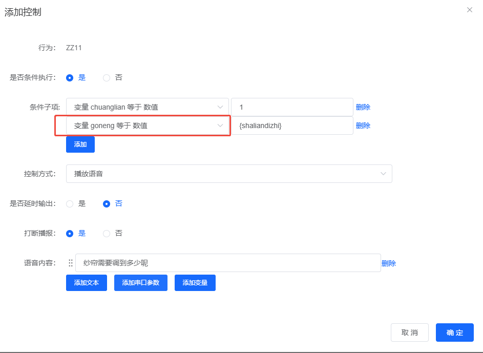
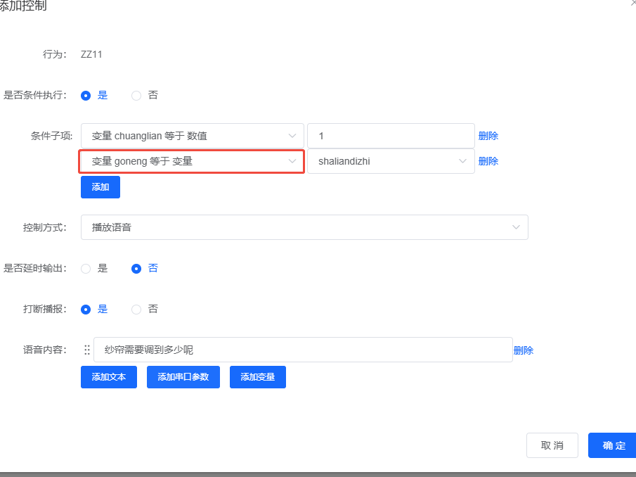
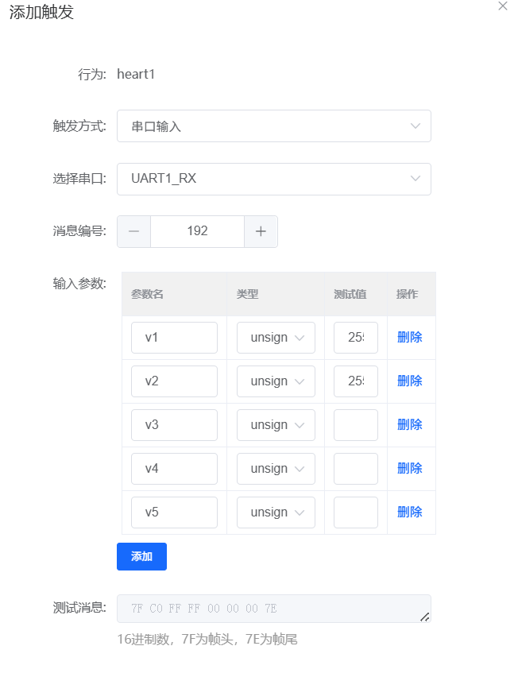

# 变量控制配置

## 问题描述

已定义变量（如LED、MEN、CHAUNG），但不清楚如何通过语音指令来控制这些变量的值，实现通过语音调节设备参数。

## 解决方案

### 1. 变量控制的作用

变量控制用于：

- **状态管理**：记录设备的开关状态
- **参数调节**：动态改变设备参数
- **逻辑控制**：实现复杂的控制逻辑
- **数据传递**：在不同命令间传递信息

### 2. 配置步骤详解

**步骤1：定义变量**

1. 进入"变量定义"页面
2. 添加新变量，设置：

    - **变量名**：符合C语言命名规则
    - **类型**：int、char、double等
    - **默认值**：初始状态值
    - **备注**：说明变量用途

示例变量：

- LED（int）：开关灯状态，0=关，1=开
- MEN（int）：开关门状态，0=关，1=开
- CHAUNG（int）：开关窗状态，0=关，1=开

**步骤2：关联命令词**

在"命令词自定义"页面：

1. 选择或新建命令词（如"开灯"）
2. 在控制详情中添加动作
3. 选择控制方式为"变量设置"

**步骤3：配置变量操作**

在"添加控制"弹窗中设置：

- **变量**：选择要控制的变量（如LED）
- **操作**：选择操作类型
    - **赋值**：设置变量为固定值
    - **加**：变量值增加指定值
    - **减**：变量值减少指定值
    - **乘**：变量值乘以指定值
    - **除**：变量值除以指定值
- **方式**：设置值的方式
    - **固定值**：输入具体数值
    - **变量值**：引用其他变量的值
    - **表达式**：使用数学表达式

### 3. 实际配置示例

**示例1：开关灯控制**

```c
// 开灯命令
void turn_on_light() {
    // 设置LED变量为1
    set_variable("LED", 1);

    // 同时控制GPIO
    set_gpio(LIGHT_PIN, HIGH);
}

// 关灯命令
void turn_off_light() {
    // 设置LED变量为0
    set_variable("LED", 0);

    // 同时控制GPIO
    set_gpio(LIGHT_PIN, LOW);
}
```

**示例2：数值调节**

```c
// 增加亮度
void increase_brightness() {
    // 亮度变量加10
    variable_add("brightness", 10);

    // 限制最大值
    if (get_variable("brightness") > 100) {
        set_variable("brightness", 100);
    }
}

// 设置具体亮度
void set_brightness(int level) {
    // 直接赋值
    set_variable("brightness", level);
}
```

**示例3：复合控制**

```c
// 开门并开灯
void open_door_and_light() {
    // 同时设置多个变量
    set_variable("MEN", 1);      // 开门
    set_variable("LED", 1);      // 开灯
    set_variable("CHAUNG", 0);    // 关窗

    // 执行相应动作
    play_tts("已开门并开灯");
}
```

### 4. 控制界面操作

**添加变量控制动作：**

1. 在"控制详情"页面点击"添加控制"
2. 选择"变量设置"类型
3. 配置各选项：

    - 选择已定义的变量
    - 选择操作类型（赋值/加/减等）
    - 设置操作值或表达式

**常用操作类型说明：**

| 操作类型 | 说明 | 示例 |
|---------|------|------|
| 赋值 | 将变量设为指定值 | LED = 1 |
| 加 | 变量值增加 | count = count + 1 |
| 减 | 变量值减少 | brightness = brightness - 10 |
| 乘 | 变量值倍增 | speed = speed * 2 |
| 除 | 变量值缩小 | speed = speed / 2 |

### 5. 高级应用

**条件判断结合变量：**

```c
// 智能开关控制
void smart_switch() {
    // 检查多个变量状态
    if (get_variable("MEN") == 1 && get_variable("LED") == 0) {
        // 门开且灯未开时自动开灯
        set_variable("LED", 1);
        set_gpio(LIGHT_PIN, HIGH);
        play_tts("检测到开门，已自动开灯");
    }
}
```

**变量作为参数：**

```c
// 通用控制函数
void control_device(String device, int state) {
    if (device == "light") {
        set_variable("LED", state);
    } else if (device == "door") {
        set_variable("MEN", state);
    } else if (device == "window") {
        set_variable("CHAUNG", state);
    }
}
```

## 注意事项

- **变量命名规范**：使用有意义的英文名或拼音
- **类型匹配**：操作时注意变量的数据类型
- **范围检查**：设置值前检查是否在有效范围内
- **状态同步**：变量状态与实际硬件状态要保持一致
- **调试技巧**：通过串口输出变量值，便于调试

## 常见问题

**Q：为什么设置变量后设备没反应？**
A：检查是否同时添加了GPIO控制动作，变量仅记录状态。

**Q：变量值能显示出来吗？**
A：可以通过串口输出或TTS播报变量值。

**Q：如何查看当前变量值？**
A：在调试模式下通过串口监视，或添加查询命令。


**Q：变量设置的"方式"应该选择"数值"还是"变量"？**
A：
- **方式选择"数值"**：直接填写具体数字（如 0、1、100 等）
- **方式选择"变量"**：从下拉列表中选择已定义的变量

**常见错误示例：**

```
错误配置：
方式：数值
数值：{变量名}    ← 错误！不能在"数值"中填变量名

正确配置1：直接设置数字
方式：数值
数值：1

正确配置2：引用变量值
方式：变量
变量：选择已定义的变量（如 goneng）
```



*错误示例：在"方式"选择"数值"时，填写了变量名{shaliandizhi}*



*正确配置：要等于变量值时，应将"方式"选择为"变量"，然后从下拉列表中选择对应变量*

**注意事项：**
- 条件执行中的变量比较同样适用此规则
- 条件子项中"变量xxx等于数值yyy"的数值栏应填数字
- 若需要与变量值比较，应选择"变量xxx等于变量yyy"的比较方式

### 6. 特殊应用：互锁开关实现

**问题描述：**

需要实现两个或多个开关的互锁功能，即打开其中一个开关时，自动关闭其他开关。

**解决方案：**

**1. 使用变量实现互锁**

定义状态变量记录当前开关状态：

- switch_state：记录当前激活的开关编号
- switch_1、switch_2、switch_3：各开关状态

**2. 配置步骤**

步骤1：定义变量
```c
int switch_state = 0;    // 0=无开关激活，1=开关1，2=开关2
int switch_1 = 0;       // 开关1状态
int switch_2 = 0;       // 开关2状态
```

步骤2：配置开关命令
每个开关命令需要：

1. 设置自身状态为1
2. 检查其他开关状态
3. 关闭其他激活的开关
4. 更新switch_state

**3. 实现逻辑示例**

```c
// 开关1命令
void switch_on_1() {
    // 检查开关2是否激活
    if (switch_2 == 1) {
        // 关闭开关2
        set_variable("switch_2", 0);
        control_gpio(SWITCH_2_PIN, LOW);
        play_tts("已关闭开关2");
    }

    // 打开开关1
    set_variable("switch_1", 1);
    set_variable("switch_state", 1);
    control_gpio(SWITCH_1_PIN, HIGH);
    play_tts("已打开开关1");
}

// 开关2命令
void switch_on_2() {
    // 检查开关1是否激活
    if (switch_1 == 1) {
        // 关闭开关1
        set_variable("switch_1", 0);
        control_gpio(SWITCH_1_PIN, LOW);
        play_tts("已关闭开关1");
    }

    // 打开开关2
    set_variable("switch_2", 1);
    set_variable("switch_state", 2);
    control_gpio(SWITCH_2_PIN, HIGH);
    play_tts("已打开开关2");
}
```

**4. 平台配置方法**

1. 为每个开关命令添加多个控制动作：

    - 变量赋值：设置当前开关状态为1
    - 条件判断：检查其他开关状态
    - 变量赋值：关闭其他开关状态
    - GPIO控制：执行实际的开关动作

2. 使用附加条件：

    - 在关闭其他开关时添加条件
    - 条件：其他开关状态为1时才执行

**注意事项：**

- 互锁逻辑需要预先定义所有相关变量
- 建议添加语音反馈，提示当前状态变化
- 可以扩展到多个开关的互锁
- 测试时验证所有开关组合

---

**方法二：使用子条件判断电平（更简单直接）**

如果不使用变量，也可以通过**子条件判断 GPIO 电平**来实现互锁：

**配置示例：**

假设需要实现 B0 和 B1 互锁（B0 开时 B1 关，B1 开时 B0 关）：

1. **B0 开启命令配置**：
   - 添加 GPIO_B0 控制动作 → 设置高电平
   - 添加条件执行（子条件）：
     - 条件：GPIO_B1 为高电平
     - 动作：设置 GPIO_B1 为低电平

2. **B1 开启命令配置**：
   - 添加 GPIO_B1 控制动作 → 设置高电平
   - 添加条件执行（子条件）：
     - 条件：GPIO_B0 为高电平
     - 动作：设置 GPIO_B0 为低电平

**优势：**

- 无需定义变量
- 配置更简单直观
- 适用于简单的双开关互锁场景

**注意事项：**

- 使用子条件判断时，条件类型选择"GPIO 输入"
- 确保判断的是正确的 GPIO 引脚和电平状态
- 这种方式只能检测当前 GPIO 的实际输出状态


---

## 串口参数如何赋值给变量？

**问题描述：**

在串口触发场景下，需要判断接收到的串口参数（如v1, v2, v3）是否为期望值，并将这些参数用于后续逻辑处理。

**解决方案：**

**1. 参数赋值给变量**

在串口触发配置后，添加"参数赋给变量"操作：

- **进入控制详情**
    - 选择串口触发行为
    - 点击"添加后续操作"

- **配置参数赋值**
    - 操作类型：选择"参数赋给变量"
    - 选择参数：v1、v2或v3
    - 目标变量：创建或选择已定义的变量
    - 确认保存配置

**2. 变量定义**

在"变量定义"页面创建所需变量：

```
变量名：serial_v1
类型  ：int
默认值：0

变量名：serial_v2
类型  ：int
默认值：0

变量名：serial_v3
类型  ：int
默认值：0
```

**3. 条件判断配置**

在后续控制逻辑中使用变量进行条件判断：

- **添加条件判断**
    - 触发方式：选择"值变化"
    - 判断对象：选择已赋值的变量
    - 设置判断条件：如等于、大于、小于

- **配置执行动作**
    - 满足条件时执行的动作
    - 不满足条件时执行的动作

**4. 完整配置流程**

```
串口接收 → 参数提取 → 赋值给变量 → 条件判断 → 执行动作
```

**示例应用：**

```
串口数据：AA 55 01 02 03 FF
参数解析：v1=0x01, v2=0x02, v3=0x03
变量赋值：serial_v1=1, serial_v2=2, serial_v3=3
条件判断：如果serial_v1==1且serial_v2==2
执行动作：GPIO_A2 = 高电平
```

**注意事项：**

- 每个串口参数需要单独赋值给对应的变量
- 变量类型要与参数类型匹配
- 条件判断要在参数赋值之后进行
- 可以参考平台提供的视频教程进行操作

**相关教程：**

- 平台提供变量控制配置视频教程
- 搜索关键词：串口参数赋值变量

---

### 串口参数如何赋值给变量？

**问题描述：**

在串口触发场景下，需要判断接收到的串口参数（如v1, v2, v3）是否为期望值，并将这些参数用于后续逻辑处理。

**解决方案：**

**1. 参数赋值给变量**

在串口触发配置后，添加"参数赋给变量"操作：

- **进入控制详情**
    - 选择串口触发行为
    - 点击"添加后续操作"

- **配置参数赋值**
    - 操作类型：选择"参数赋给变量"
    - 选择参数：v1、v2或v3
    - 目标变量：创建或选择已定义的变量
    - 确认保存配置

**2. 变量定义**

在"变量定义"页面创建所需变量：

```
变量名：serial_v1
类型  ：int
默认值：0

变量名：serial_v2
类型  ：int
默认值：0

变量名：serial_v3
类型  ：int
默认值：0
```

**3. 条件判断配置**

在后续控制逻辑中使用变量进行条件判断：

- **添加条件判断**
    - 触发方式：选择"值变化"
    - 判断对象：选择已赋值的变量
    - 设置判断条件：如等于、大于、小于

- **配置执行动作**
    - 满足条件时执行的动作
    - 不满足条件时执行的动作

**4. 完整配置流程**

```
串口接收 → 参数提取 → 赋值给变量 → 条件判断 → 执行动作
```

**示例应用：**

```
串口数据：AA 55 01 02 03 FF
参数解析：v1=0x01, v2=0x02, v3=0x03
变量赋值：serial_v1=1, serial_v2=2, serial_v3=3
条件判断：如果serial_v1==1且serial_v2==2
执行动作：GPIO_A2 = 高电平
```

**注意事项：**

- 每个串口参数需要单独赋值给对应的变量
- 变量类型要与参数类型匹配
- 条件判断要在参数赋值之后进行
- 可以参考平台提供的视频教程进行操作

**相关教程：**

- 平台提供变量控制配置视频教程
- 搜索关键词：串口参数赋值变量



---

## 小程序连接后如何自动上报数据？

**问题描述：**

希望在小程序连接上后，模块能够自动发送一次指定的端口状态和数据，以确保小程序断开重连后仍能显示正确的状态和数据。

**解决方案：**

**1. 触发方式说明**

当前平台的触发机制：

- **WiFi连接上网络**：可作为触发条件
- **小程序连接**：暂不支持作为直接触发条件
- **事件触发**：基于特定事件执行动作

**2. 替代实现方案**

由于小程序连接不能直接触发，可采用以下方法：

**方法一：使用定时上报**

1. **配置定时器**
    - 设置触发方式为"定时器"
    - 配合适的时间间隔（如5-10秒）
    - 定时执行状态上报动作

2. **上报数据内容**
    - 端口状态（GPIO输入/输出状态）
    - 变量当前值
    - 传感器数据等

**方法二：变量变化触发**

1. **配置值变化触发**
    - 选择关键状态变量
    - 设置触发条件为"值变化"
    - 变量变化时自动上报

2. **适用场景**
    - 设备状态改变时
    - 参数调整后
    - 外部事件触发后

**3. 实施步骤**

1. **创建上报变量**
    - 在变量定义中创建状态变量
    - 设置初始值
    - 确保变量名清晰易懂

2. **配置触发动作**
    - 选择合适的触发方式
    - 添加"变量设置"或"串口输出"动作
    - 配置要上报的数据

3. **小程序端显示**
    - 确保小程序控件绑定对应变量
    - 验证数据是否能正常显示
    - 测试断线重连场景

**注意事项：**

- 小程序连接事件目前平台不支持，需要使用其他触发方式
- 定时上报会占用一定的网络资源，需合理设置时间间隔
- 建议结合实际业务需求选择合适的触发机制
- 测试时注意观察数据上报的实时性和准确性