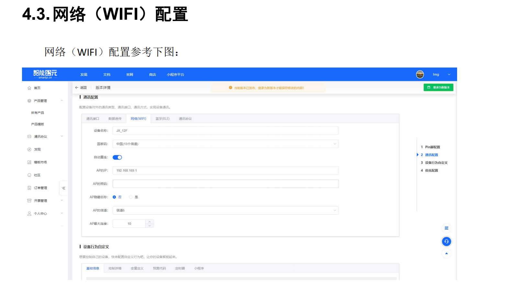
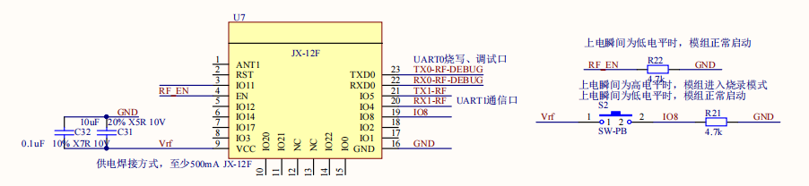
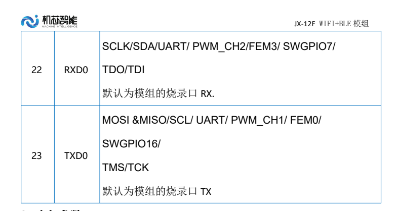

# WiFi模组 JX-12F

## 快速规格一览

| 参数 | JX-12F |
|------|--------|
| 主控芯片 | **JX-1001** (32位 RISC CPU) |
| WiFi | **2.4GHz 802.11b/g/n** |
| 蓝牙 | **BLE 5.0** |
| 供电电压 | 3.0~3.6V (推荐3.3V) |
| 接口 | UART/GPIO/ADC/DAC/PWM/I2C/SDIO/SPI/IR |
| 电源管理 | 先进PMU，多种低功耗模式 |

---

## 定位与适用场景

- **定位**：WiFi+BLE 双模无线模组，适合 IoT 应用开发
- **适用场景**：联网、云端控制、数据上报
- **云端**：默认对接智能公元平台，可扩展到自有云端

---

## 模组概述

JX-12F 是一款基于 WiFi+BLE 单芯片 SoC 为主控的无线模组，可满足低功耗和高性能的 IoT 应用开发。核心处理器 JX-1001 集成了 2.4G Wi-Fi (802.11b/g/n) 和 BLE 5.0 的基带及 MAC 设计。微控制器子系统包含一个低功耗的 32 位 RISC CPU，高速缓存和存储器。具有先进的电源管理单元，支持多种低功耗模式。

| 指标 | 描述 |
|------|------|
| 主控芯片 | JX-1001 (32位 RISC CPU + 高速缓存) |
| 无线能力 | WiFi: 2.4GHz 802.11b/g/n；BLE: 5.0 |
| 处理器 | 低功耗 32 位 RISC CPU，集成高速缓存和存储器 |
| 接口 | UART, GPIO, ADC, DAC, PWM, I2C, SDIO, SPI, IR 远程 |
| 供电 | 3.0~3.6 V (推荐3.3V) |
| 电源管理 | 先进的 PMU，支持多种低功耗模式 |

### 官方资料下载

| 资料 | 链接 |
|------|------|
| 官方文档首页 | [查看](https://help.aimachip.com/docs/jx12f) |
| 模块规格书 | [下载](https://help.aimachip.com/attach_files/jx12f/646) |
| 技术开发手册 V1.0 | [下载](https://help.aimachip.com/attach_files/jx12f/643) |
| 智能公元平台协议自定义 V1.0 | [下载](https://help.aimachip.com/attach_files/jx12f/644) |
| 开发包 (版本2403041042) | [下载](https://help.aimachip.com/attach_files/jx12f/716) |
| 烧录工具 | [下载](https://help.aimachip.com/attach_files/jx12f/642) |
| 入门例程 | [下载](https://help.aimachip.com/attach_files/jx12f/645) |

## 硬件设计指南

### 天线设计与切换

JX-12F 支持板载天线和外接天线的切换功能，可通过更改一颗电容来实现天线模式切换：


- **天线布局要求**：

    - 避开金属件至少 15 mm
    - 预留 π 匹配网络
    - 天线切换通过更改特定电容值实现

### 其他硬件设计要点

1. **电源**：预留 500 mA 峰值，增加 TVS 与 LC 滤波。
2. **接口**：将 UART 下载脚暴露为测试点，GPIO 根据应用映射。
3. **参考设计**：参考开发手册中的原理图与PCB设计指南。

### JX-12F能否实现小程序联网控制？

**问题描述：**

需要使用JX-12F模块实现小程序联网控制功能。

**解决方案：**

JX-12F完全支持小程序联网控制，具有以下优势：

1. **WiFi+BLE双模支持**：

    - WiFi：负责与云端和小程序通信
    - BLE：支持近距离配置和调试
    - 自动切换最优连接方式

2. **云端对接能力**：

    - 默认对接智能公元平台
    - 可扩展到自有云服务器
    - 支持MQTT/HTTP等协议
    - 提供API接口文档

3. **小程序集成方案**：

    - 通过WebSocket实时通信
    - 支持设备状态上报
    - 远程控制指令下发
    - 消息加密传输

**实现步骤：**

1. **云端配置**：

    - 在智能公元平台创建设备
    - 配置设备ID和密钥
    - 定义控制指令和数据格式

2. **小程序开发**：

    - 集成智能公元SDK
    - 或使用标准HTTP API
    - 实现用户认证和设备绑定

3. **设备端开发**：

    - 使用JX-12F开发包
    - 配置WiFi自动连接
    - 实现指令解析和执行

**应用场景：**

- 智能家居控制（灯光、电器等）
- 环境监测（温湿度、空气质量）
- 远程配置和OTA升级
- 数据可视化和历史记录

**技术特点：**

- 低功耗设计，适合电池供电
- 快速联网（2秒内连接）
- 稳定可靠，支持断线重连
- 开发资源丰富，有完整SDK

**注意事项：**

- 需要注册智能公元平台账号
- 小程序需要企业资质认证
- 确保网络环境支持2.4GHz WiFi
- 考虑数据安全和隐私保护

---

## 开发环境与工具准备
- [开发包下载](https://help.aimachip.com/docs/jx12f/jx12f-1f776ktu2kuik) - 包含SDK、示例代码、配置工具
- [烧录资料](https://help.aimachip.com/docs/jx12f/jx12f-1f5p1tfbs88kl) - 烧录软件与驱动
- 串口调试助手（3.3V电平）
- 智能公元平台账号（用于云端对接）

## 固件烧录与升级指南
1. 参考[烧录资料](https://help.aimachip.com/docs/jx12f/jx12f-1f5p1tfbs88kl)安装驱动和烧录工具。
2. 按"BOOT+RESET"进入下载模式，配置串口与波特率。
3. 选择固件文件并烧录。
4. 烧录完成后复位，通过串口查看日志验证。
5. OTA：通过云平台上传固件、配置灰度策略、监控升级状态。

### JX-12F下载引脚配置说明

**问题描述：**

JX-12F模块需要通过特定的引脚配置进入下载模式，了解正确的引脚定义和连接方法对固件烧录至关重要。

**解决方案：**

**下载模式引脚配置：**

**1. 必需引脚说明**

    - **BOOT引脚**：

        - 功能：进入下载模式的关键引脚
        - 正常模式：高电平或悬空
        - 下载模式：低电平（接地）
        - 上电时需要保持低电平状态

    - **RESET引脚**：

        - 功能：系统复位控制
        - 正常工作：高电平
        - 复位操作：低电平脉冲
        - 可通过按键或控制信号触发

    - **UART通信引脚**：

        - **TX (发送)**：模块发送数据到烧录工具
        - **RX (接收)**：模块接收烧录工具的数据
        - **GND**：信号地，必须共地连接
        - **波特率**：通常使用115200 bps

**2. 进入下载模式步骤**

    - **硬件连接**：

        1. 连接UART到USB转换器（TX→RX, RX→TX, GND→GND）
        2. 将BOOT引脚连接到GND
        3. 确保供电正常（3.3V）
        4. 准备RESET引脚的控制

    - **操作序列**：

        1. 确保BOOT保持低电平
        2. 给模块上电或按RESET复位
        3. 模块进入下载模式
        4. 启动烧录工具进行识别
        5. 烧录完成后释放BOOT引脚
        6. 复位模块正常启动

**3. 引脚位置参考**

    - **模块引脚布局**：

        - BOOT和RESET通常在模块边缘
        - UART引脚可能有多个复用选择
        - 查看丝印标识确认具体位置

    - **开发板标识**：

        - 开发板通常有按键标注
        - BOOT按键：进入下载模式
        - RESET按键：系统复位
        - UART测试点：便于连接调试

**4. 烧录工具配置**

    - **串口设置**：

        - 选择正确的COM端口
        - 波特率：115200
        - 数据位：8
        - 停止位：1
        - 校验位：无

    - **烧录参数**：

        - 选择对应的固件文件
        - 确认文件完整性
        - 设置正确的地址偏移
        - 选择擦除方式

**常见问题及解决：**

1. **无法进入下载模式**：

    - 检查BOOT引脚是否可靠接地
    - 确认复位时序正确
    - 测量引脚电平确认状态
    - 尝试延长低电平保持时间

2. **串口无响应**：

    - 检查UART交叉连接（TX↔RX）
    - 确认波特率设置一致
    - 验证USB转串口驱动
    - 测试串口工具是否正常

3. **烧录失败**：

    - 检查固件文件是否匹配
    - 确认供电稳定
    - 尝试降低波特率
    - 重新进入下载模式

**注意事项：**

- BOOT引脚必须在模块启动时保持低电平
- 烧录过程中不要断开连接
- 建议使用官方提供的烧录工具
- 保留原始固件备份
- 注意ESD防护，避免静电损坏

## 外设开发与应用指南
- **GPIO/继电器控制**：通过AT指令或SDK API控制GPIO状态。
- **串口透传**：配置为透传模式，将模组作为WiFi桥接设备。
- **云端属性**：在智能公元平台绑定设备模板，实现远程控制和数据上报。
- **与语音模组联动**：通过 UART 与 CI/SU 系列语音模组协作，实现语音+联网功能。

> 详细示例请参考：[参考例程](https://help.aimachip.com/docs/jx12f/jx12f-1f5tmcpj0j3oq)

---

## 网络配置与数据透传

### JX-12F配网时搜索不到手机热点怎么办？

**问题描述：**

为JX-12F模块配网时，无法搜索到自己手机开启的热点，导致无法完成配网操作。

**解决方案：**

**配网原理说明：**

JX-12F配网时，手机连接的热点与模块需要连接的热点必须是同一个。这是因为：

- 配网过程需要手机作为中转设备
- 模块通过手机获取网络信息
- 系统限制不允许手机连接自身开启的热点

**解决方案：**

1. **使用电脑分享热点**
    - 电脑开启WiFi热点
    - 手机连接电脑热点
    - 模块配网时搜索到电脑热点并连接
    - 完成网络配置

2. **使用其他设备**
    - 使用第二部手机开启热点
    - 配网手机连接该热点
    - 完成模块的网络配置

3. **使用现有2.4GHz路由器**
    - 确保路由器为2.4GHz频段
    - 手机和模块连接同一个路由器
    - 通过路由器网络完成配网

**配网步骤：**

1. 开启电脑或其他设备的WiFi热点
2. 手机连接到该热点
3. 打开智能公元小程序，开始配网
4. 搜索并选择刚才开启的热点
5. 输入密码完成配网

**注意事项：**

- 手机不能连接自己开启的热点（系统限制）
- 必须使用中间设备作为热点桥梁
- 确保热点为2.4GHz频段（JX-12F不支持5GHz）
- 开启手机的蓝牙和定位权限

---

### 手机搜索不到JX-12F的WiFi名称怎么办？

**问题描述：**

在手机WiFi列表中无法找到JX-12F模块的WiFi名称（JX_12F），导致无法进行网络配置和连接。

**解决方案：**

1. **检查模块工作状态**：

    - 通过串口查看模块启动日志
    - 确认WiFi功能已正常初始化
    - 验证模块是否已进入AP模式

2. **检查WiFi配置参数**：

    - 确认设备名称设置为"JX_12F"
    - 检查AP隐藏名称设置为"否"
    - 验证信道设置为6（或自动选择）
    - 确认最大连接数设置合理

3. **环境排查**：

    - 靠近模块（1-2米范围内）搜索
    - 避免金属遮挡物干扰
    - 重启手机WiFi功能
    - 刷新WiFi列表重新搜索

4. **硬件检查**：

    - 确认模块供电正常（3.3V）
    - 检查天线连接是否良好
    - 验证模块已正常启动（指示灯状态）

**注意事项：**

- JX-12F默认AP模式名称为"JX_12F"
- 模块启动需要一定时间，建议等待30秒后再搜索
- 如果仍无法找到，可尝试恢复出厂设置



---

### 如何实现串口数据透传到指定服务器？

**问题描述：**

需要实现外部模块通过串口发送数据给JX-12F，WiFi模块将数据透传到指定IP的本地服务器功能。

**解决方案：**

JX-12F支持串口透传功能，可通过以下方式实现：

1. **硬件连接**：

    - 外部模块串口TX → JX-12F的RX
    - 外部模块串口RX → JX-12F的TX
    - 共地连接（GND）
    - 注意电平匹配（3.3V TTL）

2. **配置透传模式**：

    - 在智能公元平台配置"串口透传"功能
    - 设置目标服务器IP和端口号
    - 选择通信协议（TCP/UDP）
    - 配置波特率等串口参数

3. **数据传输流程**：

    - JX-12F自动创建WiFi连接到指定服务器
    - 串口接收的数据实时转发到服务器
    - 支持双向数据传输
    - 可配置心跳包维持连接

4. **开发示例**：

    - 使用平台生成的例程代码
    - 修改服务器地址和端口
    - 测试串口数据收发功能
    - 验证数据完整性

**配置要点：**

- 服务器IP必须是局域网内可访问的地址
- 端口号需与服务器监听端口一致
- 建议使用TCP协议保证数据可靠性
- 可配置数据格式（十六进制/ASCII）

**注意事项：**

- 透传模式下模块不会处理数据内容
- 需要外部设备确保数据格式正确
- 建议添加数据校验机制
- 注意网络断连重连机制

---

### JX-12F如何实现上电自动连接服务器？

**问题描述：**

JX-12F的WiFi模块是否可以通过GPIO-22的低电平触发连接服务器，是否有其他方式可以实现模块上电后自动连接到指定的本地服务器。

**解决方案：**

**自动连接配置方法：**

1. **默认连接方式**：

    - JX-12F模块支持上电后自动连接服务器
    - 无需通过GPIO-22低电平触发
    - 可直接配置为自动连接模式

2. **配置步骤**：

    - 在平台中配置为"事件触发"模式
    - 选择"自动触发"作为连接方式
    - 设置目标服务器IP和端口
    - 生成固件后自动生效

**多种连接途径：**

1. **GPIO触发连接**：

    - GPIO-22低电平输入触发连接
    - 适用于按需连接的场景
    - 可通过外部控制连接时机

2. **自动连接模式**：

    - 模块上电后自动扫描并连接
    - 无需外部触发信号
    - 适合持续在线的应用

3. **语音控制连接**：

    - 通过语音指令控制连接
    - 支持"连接WiFi"等命令
    - 提供用户交互式控制

4. **定时连接**：

    - 支持定时自动连接
    - 可设置连接时间策略
    - 用于节能或按需连接

**配置界面说明：**

1. **触发方式选择**：

    - 事件触发：自动或GPIO触发
    - 语音触发：通过语音命令
    - 接口触发：通过串口命令

2. **连接参数设置**：

    - 服务器IP：指定目标服务器地址
    - 端口号：设置通信端口
    - 协议类型：TCP或UDP
    - 重连机制：断线自动重连


*GPIO输入触发配置界面，可选择GPIO-22低电平触发*


*事件触发配置界面，设置为自动触发模式*

**实施建议：**

1. **使用自动连接**：

    - 推荐使用自动连接模式
    - 上电即连接，无需额外操作
    - 简化系统设计

2. **备用触发方式**：

    - 同时保留GPIO触发功能
    - 特殊情况下可手动控制
    - 提高系统灵活性

3. **网络配置优化**：

    - 预设多个WiFi热点
    - 优先级自动切换
    - 提高连接成功率

**技术要点：**

- 自动连接是固件内置功能
- 不需要额外的硬件触发电路
- 支持多种触发方式并存
- 连接参数可通过平台配置

**注意事项：**

- 自动连接会增加功耗
- 根据应用需求选择合适方式
- 保留手动控制接口便于调试
- 建议测试连接稳定性后再量产

---

## 参考链接

| 资源 | 链接 |
|------|------|
| JX-12F 官方文档首页 | [https://help.aimachip.com/docs/jx12f](https://help.aimachip.com/docs/jx12f) |
| 智能公元平台 | [https://smartpi.cn](https://smartpi.cn) |


### JX-12F2开发板插入USB后亮灯但小程序搜索不到设备怎么办？

**问题描述：**

JX-12F2开发板插入USB口后，红灯和白灯亮起，但在微信小程序中搜索不到设备，点击搜索后立即显示错误。

**解决方案：**

**问题分析：**

JX-12F2开发板上电后指示灯状态说明：

- **红灯亮起**：模块供电正常
- **白灯亮起**：系统正在启动或初始化
- **搜索失败**：可能是网络配置或固件问题

**排查步骤：**

1. **确认设备状态**

    - 等待30秒让设备完全启动
    - 观察指示灯是否有变化
    - 正常启动后白灯会规律闪烁

2. **小程序搜索操作**

    - 打开微信，搜索"智能公元"小程序
    - 确保手机蓝牙和定位权限已开启
    - 在小程序首页点击"+"添加设备

3. **搜索不到的可能原因**

    - **设备未完全启动**：需要等待更长时间
    - **网络环境问题**：2.4GHz WiFi干扰
    - **小程序权限问题**：蓝牙未开启
    - **固件版本问题**：需要更新固件

**解决方法：**

1. **基础检查**

    - 确认USB供电正常（5V）
    - 检查USB线缆是否完好
    - 尝试更换不同的USB端口

2. **重新启动设备**

    - 断开USB连接
    - 等待10秒后重新连接
    - 等待指示灯稳定后再搜索

3. **网络环境优化**

    - 靠近路由器增强信号
    - 避免金属遮挡物
    - 减少其他2.4GHz设备干扰

4. **权限设置检查**

    - 进入手机设置→应用管理→微信
    - 开启蓝牙权限
    - 开启位置信息权限

5. **固件检查**

    - 联系技术支持确认固件版本
    - 如需要，重新烧录最新固件
    - 确认WiFi功能已正确配置

**注意事项：**

- JX-12F2需要一定的启动时间，请耐心等待
- 小程序搜索时确保手机网络正常
- 如多次尝试仍失败，可尝试恢复出厂设置
- 开发阶段建议使用串口调试查看具体状态

---

## 硬件设计要点

### JX-12F2硬件设计注意事项

**问题描述：**

进行JX-12F2模块的硬件设计时，需要关注电源设计、启动模式控制和外围电路连接。

**解决方案：**

**电源设计：**

1. **供电要求**：

    - 工作电压：3.3V
    - 峰值电流：可达300mA（WiFi发射时）
    - 推荐使用SPX3819或同等规格的LDO（500mA输出能力）

2. **电源电路优化**：

    - 输入输出滤波电容必须配置
    - 建议使用10μF+0.1μF组合滤波


**启动模式控制：**

- 安装R20为烧录模式，安装R21为运行模式
- RST引脚：常规版本无电气功能，相关电路可省略

**EN使能控制：**

- 高电平：模块工作；低电平：模块关闭
- 适用于可穿戴设备的间歇工作场景

**注意事项：**

- 电源设计必须保证300mA的峰值电流供应
- 烧录和运行模式通过电阻选择，不要同时安装

---

## 功耗管理

### JX-12F2功耗特性分析

**功耗数据参考：**

| 工作模式 | 电流消耗 | 说明 |
|---------|---------|------|
| RX（接收） | 典型值 80mA | WiFi数据接收 |
| TX（发射） | 典型值 300mA | WiFi数据发射 |
| Sleep | 典型值 10μA | 睡眠模式 |
| Hibernate | 典型值 5μA | 深度休眠 |


**可穿戴设备应用建议：**

- 使用EN引脚控制模块开关
- 间歇工作：仅在需要时唤醒模块
- 独立的3.3V LDO供电（500mA能力）

---

## 供电问题排查

### JX-12F2使用线性电源无法正常上电怎么办？

**问题描述：**

使用线性电源3.3V/1A为JX-12F2模块供电时，模块上电异常，电流为0A。

**解决方案：**

1. **EN引脚控制问题**：模组内部EN引脚有上拉电阻，外部下拉会导致模块关闭
2. **MCU输出配置**：推荐使用开漏（Open-Drain）输出模式
3. **启动时序**：MCU上电稳定后延时500ms再拉高EN引脚



**注意事项：**

- 模组内部有EN引脚上拉电阻（约4.7kΩ）
- MCU控制时推荐使用开漏输出模式

---

## 串口通信配置

### JX-12F2的UART0和UART1如何区分使用？

**串口功能定义：**

1. **UART0（TXD0/RXD0）**：固件烧录口，引脚位置固定
2. **UART1（可配置）**：与外部MCU通信，可配置到IO4/IO5



**使用建议：**

- 固件烧录：使用UART0，波特率115200bps
- MCU通信：使用UART1（IO4/IO5）

---

## 蓝牙配网问题排查

### JX-12F蓝牙配网时小程序搜索不到设备怎么办？

**问题描述：**

使用JX-12F模块进行蓝牙配网时，虽然手机蓝牙能搜索到模块，但在小程序中无法搜索到设备。

**解决方案：**

**权限检查与设置：**

1. 在手机系统设置中开启"位置信息"权限
2. 确保小程序已获取蓝牙和位置权限
3. 华为鸿蒙系统需要额外检查系统权限管理

**硬件操作检查：**

1. 配网时需要将IO0引脚拉低
2. 不能连接手机自身开启的热点，需要连接其他2.4GHz WiFi

**注意事项：**

- 小程序搜索蓝牙设备需要位置权限，这是系统限制
- IO0引脚电平错误会导致模块无法正常工作

---

### 小程序搜索设备时提示"搜索错误"怎么办？

**问题描述：**

在微信小程序中搜索设备时，弹出"搜索错误"提示。

**解决方案：**

1. **检查蓝牙权限**：设置 → 应用管理 → 微信 → 权限 → 蓝牙 → 选择"使用小程序时允许"
2. **检查定位权限**：设置 → 应用管理 → 微信 → 权限 → 位置 → 选择"使用小程序时允许"

| 错误设置 | 正确设置 |
|-----------|-----------|
| "使用时询问" | "使用小程序时允许" |
| "不允许" | "使用小程序时允许" |

**注意事项：**

- 蓝牙搜索需要位置权限是iOS/Android系统的要求
- 权限只需要设置一次，后续使用无需重复设置

---

## 串口通信协议配置

### JX-12F如何通过UART1实现Modbus协议通信？

**问题描述：**

需要配置JX-12F通过串口1与单片机进行Modbus协议通信。

**解决方案：**

**硬件连接：**

- UART1_TX（IO5）连接单片机RX
- UART1_RX（IO4）连接单片机TX
- 共地连接

**通信参数配置：**

- 波特率：9600/19200/38400/57600/115200 bps
- 数据位：8位，停止位：1位

**注意事项：**

- Modbus协议需要在平台中配置协议模板
- 串口通信参数必须与单片机一致

---

## 数据传输延迟问题

### 如何排查和解决小程序数据更新延迟问题？

**问题描述：**

小程序控制和设备数据反馈存在长时间延迟。

**解决方案：**

**日志调试方法：**

- IO7和IO16是日志输出引脚
- 波特率设置为2000000 bps

**延迟问题定位：**

1. **模块端延迟**：单片机数据给模块后，模块上报延迟
2. **小程序端延迟**：小程序接收数据后显示延迟
3. **网络延迟**：数据传输过程中的网络问题

**调试建议：**

- 使用稳定的WiFi网络，避免使用手机热点
- 合理设置上报频率

---

## 常见问题FAQ

### JX-12F模块如何实现485转WiFi功能？

**问题描述：**

现有产品使用485通讯，希望通过模块读取485协议并上传到WiFi。

**解决方案：**

1. **硬件连接**：JX-12F串口输出为TTL电平（3.3V），需要自行设计TTL转485转换电路
2. **转换电路**：推荐使用MAX485或类似485转换芯片
3. **软件实现**：模块通过UART读取485设备数据，解析Modbus协议，通过WiFi上传

**注意事项：**

- 485总线两端需添加120Ω终端电阻
- 485通信为半双工模式，需要控制收发切换时序
- 工业环境建议增加防雷、防静电保护措施

---

### 多个JX-12F设备连接同一WiFi时如何区分？

**解决方案：**

1. **MAC地址区分**：每个模块的WiFi MAC地址都是全球唯一
2. **设备名称自定义**：用户可为每个设备设置独特的名称
3. **设备ID管理**：在固件程序中为每个设备分配唯一ID


**注意事项：**

- MAC地址不可更改，是设备的根本标识
- 设备名称可随时修改，不影响设备功能

---

## 生产工艺要求

### JX-12F模块支持回流焊吗？

**解决方案：**

JX-12F模块支持机器回流焊。

**回流焊温度参数：**

- **预热区**：140-160°C，持续60-90秒
- **恒温区**：180-200°C，持续60-90秒
- **回流区**：最高温度235°C，持续40-50秒
- **冷却区**：自然冷却，速率控制在2-4°C/秒

**注意事项：**

- 峰值温度不应超过240°C
- 235°C以上持续时间不超过60秒

---

## PWM输出配置

### JX-12F的PWM输出是否可以设置占空比？

**解决方案：**

JX-12F模块支持PWM输出功能，可以在智能公元平台上进行占空比设置。

**配置步骤：**

1. 登录智能公元平台
2. 选择PWM输出通道（如PWM_A2）
3. 设置频率值（如2000Hz）
4. 设置占空比（如0-100%）


**PWM参数说明：**

- **频率范围**：1Hz-20kHz可调
- **占空比范围**：0%-100%可调
- **输出电平**：3.3V

**应用示例：**

- LED亮度控制：频率1kHz，占空比调节亮度
- 电机速度控制：频率10kHz，占空比调节速度
- 舵机角度控制：频率50Hz，占空比5-10%控制角度

---

## GPIO与外部设备交互

### JX-12F如何接收外部检测模块的信号？

**问题描述：**

希望使用JX-12F模块接收外部检测模块（如人体感应）的信号。

**解决方案：**

1. **GPIO输入检测**：将GPIO引脚配置为输入模式，内部默认上拉为高电平
2. **硬件连接**：外部检测模块信号输出端连接GPIO输入引脚

**数据上传与控制流程：**

1. 外部模块检测到信号，输出低电平给JX-12F
2. JX-12F自动连接TCP服务器，发送检测信息
3. 后台服务器返回控制信号

**注意事项：**

- GPIO输入电压范围为0-3.3V，注意电平匹配
- 建议在信号线上添加保护电路

---

## Linux二次开发

### JX-12F如何进行Linux二次开发？

**开发环境搭建：**

1. 推荐使用Ubuntu 18.04或20.04虚拟机
2. 配置至少4GB内存、50GB硬盘空间
3. 下载JX-12F开发包（版本2403041042）

**工具链配置：**

```bash
# 安装基本工具
sudo apt-get update
sudo apt-get install make gcc git python3

# 配置交叉编译工具链
export PATH=$PATH:/opt/toolchain-xtensa/bin
```

**编译与烧录：**

```bash
# 编译固件
make clean
make all

# 烧录到模块
make flash PORT=/dev/ttyUSB0
```


---

## TCP通信配置

### JX-12F TCP通信配置方法

**配置步骤：**

1. 进入智能公元平台的通讯接口配置界面
2. 选择TCP通信模式
3. 输入服务端的对端地址和端口


**触发条件配置：**

- 设置特定的GPIO输入作为TCP连接触发条件
- 支持模块上电后自动连接


**网络拓扑说明：**

- JX-12F作为客户端，支持多个JX-12F连接同一服务端
- 从属模块之间不直接通信

---

## 平台配置错误处理

### AI产品零代码平台配置错误怎么办？

**常见错误提示：**

- "行为名不能为空"
- "命令词不能为空"
- "控制类型不要使用GPIO_A28"


1. 根据提示逐项修改
2. 避免使用GPIO_A28等受限引脚
3. 确保每个行为都有名称和触发条件

---

### 如何生成JX-12F固件配置的JSON文件？

**导出操作步骤：**

1. 登录智能公元平台：https://www.smartpi.cn
2. 选择对应的JX-12F项目
3. 退回到上一级界面，点击"导出"按钮
4. 系统自动生成并下载JSON配置文件

**使用场景：**

- 配置备份
- 配置分享
- 批量配置

---

## 注意事项

1. **供电要求**：模块工作电压为3.3V，需注意电源设计
2. **天线设计**：WiFi和蓝牙天线需要合理布局，避免干扰
3. **串口通信**：模块串口为TTL电平，连接其他设备时注意电平匹配
4. **功耗管理**：根据应用需求选择合适的工作模式和休眠策略
5. **生产工艺**：模块支持回流焊，峰值温度不超过240°C

---

## IO口信号接收与小程序通知

### 如何使用JX-12F实现IO口信号接收并发送小程序通知？

**功能需求：**

使用4个IO口接收信号，当检测到低电平信号时，通过小程序通知具体是哪个IO口被触发。

**实现方案：**

**1. 入门例程使用**

- 下载官方入门例程：`入门例程JX-12F.json`
- 例程版本：20250516002
- 功能描述：IO0输入低电平，小程序通知演示

**2. 平台配置步骤**

登录智能公元平台，进入设备行为自定义界面：

- **设备预览**：显示当前IO口状态
- **设备配置**：设置设备名称、ID、小程序AppID等信息
- **事件配置**：定义IO口触发条件和执行动作

**3. 事件列表配置**

在设备行为自定义中配置以下事件：

```
事件17：IO0输入低电平 → 小程序通知
事件18：IO0输入高电平 → 小程序通知
```

可扩展配置：

```
IO0输入低电平 → 小程序通知"IO0触发"
IO1输入低电平 → 小程序通知"IO1触发"
IO2输入低电平 → 小程序通知"IO2触发"
IO3输入低电平 → 小程序通知"IO3触发"
```

**4. 实现流程**

```
IO口电平变化 → 模块检测 → 平台判断 → 小程序推送通知
```

**注意事项：**

- IO口默认为上拉输入，低电平触发更可靠
- 确保模块已连接到WiFi网络
- 小程序需要绑定对应设备才能接收通知
- 支持多个IO口同时监控

---

### JX-12F能用于红外感应器数据上报吗？

**问题描述：**

想使用JX-12F WiFi+BLE模块实现红外线感应器检测玻璃瓶内物体状态，并将无物体时的提示信息发送到手机，咨询该模块是否支持此功能，以及如何实现多模块部署和编程。

**解决方案：**

1. **功能确认**
    - JX-12F可以接收红外感应器信号并发送到手机
    - 支持生成小程序，便于移动端接收通知
    - 兼容ESP12F/ESP8266系列开发方式

2. **多模块部署方案**
    - 采用一主多从架构
    - 子模块之间不需相互通信
    - 各子模块独立与服务端建立TCP连接

3. **开发支持**
    - 一般逻辑和功能可直接在智能公元平台配置
    - Arduino Uno不可用于JX-12F编程
    - 提供技术支持协助开发
    - 提供IoT协议文档参考

**注意事项：**

- 需要购买JX-12F开发板和数据充电线
- 具体配件和方案可咨询淘宝客服
- 例程可导入平台了解配置方法

---

### 如何实现两个JX12F模块之间的WiFi透传通信？

**问题描述：**

需要实现两个JX12F模块通过WiFi进行透传数据通信，实现模块间的无线数据传输。

**解决方案：**

**通信架构设计**

两个JX12F模块之间无法直接建立通信，需要通过中间服务器实现数据转发：

```
JX12F-A ←→ WiFi网络 ←→ 服务器/路由器 ←→ WiFi网络 ←→ JX12F-B
```

**实现方案**

**方案一：通过云端服务器转发**

1. **硬件准备**
    - 两个JX12F模块
    - 确保模块供电正常（3.3V）
    - 检查天线连接良好

2. **网络配置**
    - 两个模块连接到同一WiFi网络
    - 或分别连接到可访问公网的网络
    - 记录两个模块的设备ID

3. **服务器端配置**
    - 在智能公元平台创建数据转发服务
    - 配置消息路由规则
    - 设置数据转发逻辑

4. **模块A配置（发送端）**
    ```
    - 配置为TCP客户端模式
    - 设置目标服务器地址
    - 配置串口波特率（如115200）
    - 启用透传模式
    ```

5. **模块B配置（接收端）**
    ```
    - 配置为TCP客户端模式
    - 订阅模块A的数据主题
    - 设置串口输出参数
    - 配置数据接收处理
    ```

**方案二：通过本地路由器转发**

1. **组网方式**
    - 两个模块连接到同一路由器
    - 使用路由器的端口转发功能
    - 或配置模块为AP+STA模式

2. **直连配置**
    - 模块A配置为TCP服务器
    - 模块B配置为TCP客户端
    - 设置固定的内网IP地址

3. **通信测试**
    ```
    模块A（服务器）：

    - IP：192.168.1.100
    - 端口：8080
    - 监听连接请求

    模块B（客户端）：

    - 连接地址：192.168.1.100:8080
    - 自动重连机制
    - 心跳包维持连接
    ```

**代码示例**

模块A发送数据：
```python
# 通过串口发送数据到JX12F
ser.write(b'Hello from Module A')
# JX12F自动转发到服务器
```

模块B接收数据：
```python
# 服务器转发数据到模块B
# 模块B通过串口输出
data = ser.readline()
print(data.decode())  # 输出: Hello from Module A
```

**配置参数**

| 参数 | 推荐值 | 说明 |
|------|--------|------|
| 通信协议 | TCP | 保证数据可靠性 |
| 端口号 | 8080/8888 | 避免常用端口冲突 |
| 波特率 | 9600/115200 | 根据需求选择 |
| 数据格式 | ASCII/HEX | 支持两种格式 |
| 心跳间隔 | 30秒 | 维持连接稳定 |

**注意事项**

- 两个JX12F模块不能直接点对点通信
- 必须通过服务器或路由器中转
- 确保网络稳定性，设置断线重连
- 建议添加数据校验和重传机制
- 可考虑使用MQTT协议简化消息路由

