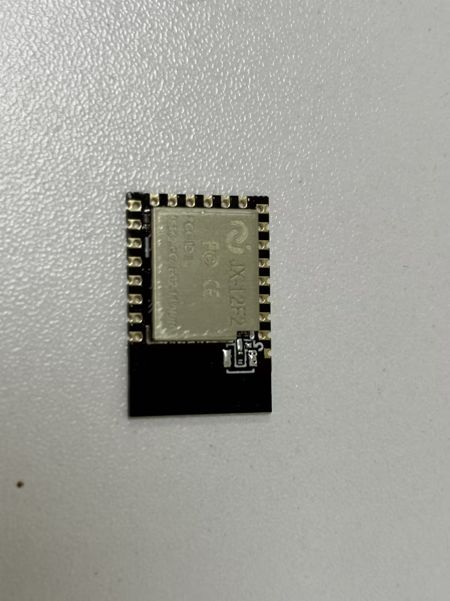
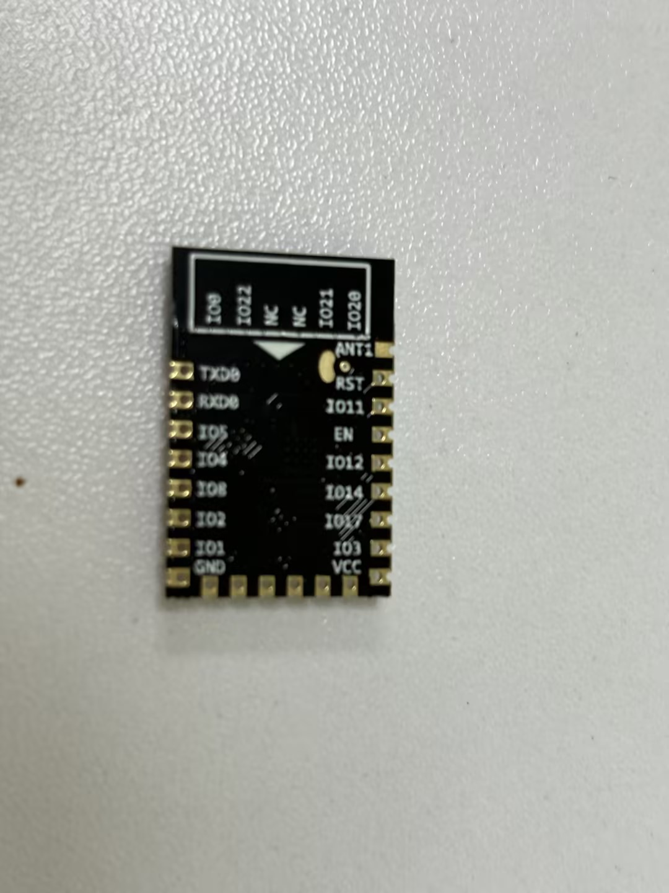
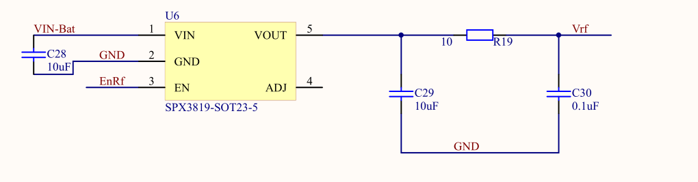
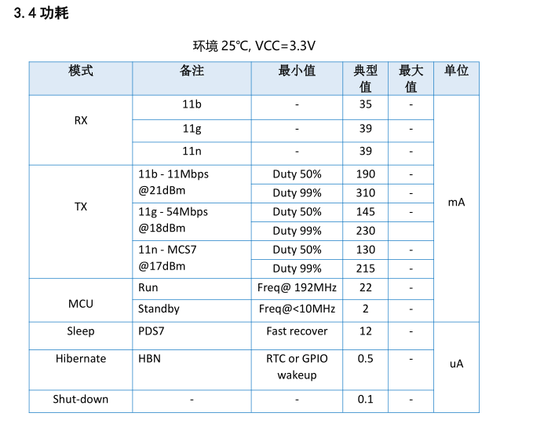

# WiFi模组 JX-12F

## 快速规格一览

| 参数 | JX-12F |
|------|--------|
| 主控芯片 | **JX-1001** (32位 RISC CPU) |
| WiFi | **2.4GHz 802.11b/g/n** |
| 蓝牙 | **BLE 5.0** |
| 供电电压 | 3.0~3.6V (推荐3.3V) |
| 接口 | UART/GPIO/ADC/DAC/PWM/I2C/SDIO/SPI/IR |
| 电源管理 | 先进PMU，多种低功耗模式 |

---

## 定位与适用场景

- **定位**：WiFi+BLE 双模无线模组，适合 IoT 应用开发
- **适用场景**：联网、云端控制、数据上报
- **云端**：默认对接智能公元平台，可扩展到自有云端

---

## 模组概述

JX-12F 是一款基于 WiFi+BLE 单芯片 SoC 为主控的无线模组，可满足低功耗和高性能的 IoT 应用开发。核心处理器 JX-1001 集成了 2.4G Wi-Fi (802.11b/g/n) 和 BLE 5.0 的基带及 MAC 设计。微控制器子系统包含一个低功耗的 32 位 RISC CPU，高速缓存和存储器。具有先进的电源管理单元，支持多种低功耗模式。

| 指标 | 描述 |
|------|------|
| 主控芯片 | JX-1001 (32位 RISC CPU + 高速缓存) |
| 无线能力 | WiFi: 2.4GHz 802.11b/g/n；BLE: 5.0 |
| 处理器 | 低功耗 32 位 RISC CPU，集成高速缓存和存储器 |
| 接口 | UART, GPIO, ADC, DAC, PWM, I2C, SDIO, SPI, IR 远程 |
| 供电 | 3.0~3.6 V (推荐3.3V) |
| 电源管理 | 先进的 PMU，支持多种低功耗模式 |

### 官方资料下载

| 资料 | 链接 |
|------|------|
| 官方文档首页 | [查看](https://help.aimachip.com/docs/jx12f) |
| 模块规格书 | [下载](https://help.aimachip.com/attach_files/jx12f/646) |
| 技术开发手册 V1.0 | [下载](https://help.aimachip.com/attach_files/jx12f/643) |
| 智能公元平台协议自定义 V1.0 | [下载](https://help.aimachip.com/attach_files/jx12f/644) |
| 开发包 (版本2403041042) | [下载](https://help.aimachip.com/attach_files/jx12f/716) |
| 烧录工具 | [下载](https://help.aimachip.com/attach_files/jx12f/642) |
| 入门例程 | [下载](https://help.aimachip.com/attach_files/jx12f/645) |

## 硬件设计指南

### 天线设计与切换

JX-12F 支持板载天线和外接天线的切换功能，可通过更改一颗电容来实现天线模式切换：

- **天线布局要求**：

    - 避开金属件至少 15 mm
    - 预留 π 匹配网络
    - 天线切换通过更改特定电容值实现

### 其他硬件设计要点

1. **电源**：预留 500 mA 峰值，增加 TVS 与 LC 滤波。
2. **接口**：将 UART 下载脚暴露为测试点，GPIO 根据应用映射。
3. **参考设计**：参考开发手册中的原理图与PCB设计指南。

### JX-12F能否实现小程序联网控制？

**问题描述：**

需要使用JX-12F模块实现小程序联网控制功能。

**解决方案：**

JX-12F完全支持小程序联网控制，具有以下优势：

1. **WiFi+BLE双模支持**：

    - WiFi：负责与云端和小程序通信
    - BLE：支持近距离配置和调试
    - 自动切换最优连接方式

2. **云端对接能力**：

    - 默认对接智能公元平台
    - 可扩展到自有云服务器
    - 支持MQTT/HTTP等协议
    - 提供API接口文档

3. **小程序集成方案**：

    - 通过WebSocket实时通信
    - 支持设备状态上报
    - 远程控制指令下发
    - 消息加密传输

**实现步骤：**

1. **云端配置**：

    - 在智能公元平台创建设备
    - 配置设备ID和密钥
    - 定义控制指令和数据格式

2. **小程序开发**：

    - 集成智能公元SDK
    - 或使用标准HTTP API
    - 实现用户认证和设备绑定

3. **设备端开发**：

    - 使用JX-12F开发包
    - 配置WiFi自动连接
    - 实现指令解析和执行

**应用场景：**

- 智能家居控制（灯光、电器等）
- 环境监测（温湿度、空气质量）
- 远程配置和OTA升级
- 数据可视化和历史记录

**技术特点：**

- 低功耗设计，适合电池供电
- 快速联网（2秒内连接）
- 稳定可靠，支持断线重连
- 开发资源丰富，有完整SDK

**注意事项：**

- 需要注册智能公元平台账号
- 小程序需要企业资质认证
- 确保网络环境支持2.4GHz WiFi
- 考虑数据安全和隐私保护

---

## 开发环境与工具准备
- [开发包下载](https://help.aimachip.com/docs/jx12f/jx12f-1f776ktu2kuik) - 包含SDK、示例代码、配置工具
- [烧录资料](https://help.aimachip.com/docs/jx12f/jx12f-1f5p1tfbs88kl) - 烧录软件与驱动
- 串口调试助手（3.3V电平）
- 智能公元平台账号（用于云端对接）

## 固件烧录与升级指南
1. 参考[烧录资料](https://help.aimachip.com/docs/jx12f/jx12f-1f5p1tfbs88kl)安装驱动和烧录工具。
2. 按"BOOT+RESET"进入下载模式，配置串口与波特率。
3. 选择固件文件并烧录。
4. 烧录完成后复位，通过串口查看日志验证。
5. OTA：通过云平台上传固件、配置灰度策略、监控升级状态。

### JX-12F下载引脚配置说明

**问题描述：**

JX-12F模块需要通过特定的引脚配置进入下载模式，了解正确的引脚定义和连接方法对固件烧录至关重要。

**解决方案：**

**下载模式引脚配置：**

**1. 必需引脚说明**

    - **BOOT引脚**：

        - 功能：进入下载模式的关键引脚
        - 正常模式：高电平或悬空
        - 下载模式：低电平（接地）
        - 上电时需要保持低电平状态

    - **RESET引脚**：

        - 功能：系统复位控制
        - 正常工作：高电平
        - 复位操作：低电平脉冲
        - 可通过按键或控制信号触发

    - **UART通信引脚**：

        - **TX (发送)**：模块发送数据到烧录工具
        - **RX (接收)**：模块接收烧录工具的数据
        - **GND**：信号地，必须共地连接
        - **波特率**：通常使用115200 bps

**2. 进入下载模式步骤**

    - **硬件连接**：

        1. 连接UART到USB转换器（TX→RX, RX→TX, GND→GND）
        2. 将BOOT引脚连接到GND
        3. 确保供电正常（3.3V）
        4. 准备RESET引脚的控制

    - **操作序列**：

        1. 确保BOOT保持低电平
        2. 给模块上电或按RESET复位
        3. 模块进入下载模式
        4. 启动烧录工具进行识别
        5. 烧录完成后释放BOOT引脚
        6. 复位模块正常启动

**3. 引脚位置参考**

    - **模块引脚布局**：

        - BOOT和RESET通常在模块边缘
        - UART引脚可能有多个复用选择
        - 查看丝印标识确认具体位置

    - **开发板标识**：

        - 开发板通常有按键标注
        - BOOT按键：进入下载模式
        - RESET按键：系统复位
        - UART测试点：便于连接调试

**4. 烧录工具配置**

    - **串口设置**：

        - 选择正确的COM端口
        - 波特率：115200
        - 数据位：8
        - 停止位：1
        - 校验位：无

    - **烧录参数**：

        - 选择对应的固件文件
        - 确认文件完整性
        - 设置正确的地址偏移
        - 选择擦除方式

**常见问题及解决：**

1. **无法进入下载模式**：

    - 检查BOOT引脚是否可靠接地
    - 确认复位时序正确
    - 测量引脚电平确认状态
    - 尝试延长低电平保持时间

2. **串口无响应**：

    - 检查UART交叉连接（TX↔RX）
    - 确认波特率设置一致
    - 验证USB转串口驱动
    - 测试串口工具是否正常

3. **烧录失败**：

    - 检查固件文件是否匹配
    - 确认供电稳定
    - 尝试降低波特率
    - 重新进入下载模式

**注意事项：**

- BOOT引脚必须在模块启动时保持低电平
- 烧录过程中不要断开连接
- 建议使用官方提供的烧录工具
- 保留原始固件备份
- 注意ESD防护，避免静电损坏

## 外设开发与应用指南
- **GPIO/继电器控制**：通过AT指令或SDK API控制GPIO状态。
- **串口透传**：配置为透传模式，将模组作为WiFi桥接设备。
- **云端属性**：在智能公元平台绑定设备模板，实现远程控制和数据上报。
- **与语音模组联动**：通过 UART 与 CI/SU 系列语音模组协作，实现语音+联网功能。

> 详细示例请参考：[参考例程](https://help.aimachip.com/docs/jx12f/jx12f-1f5tmcpj0j3oq)

---

## 参考链接

| 资源 | 链接 |
|------|------|
| JX-12F 官方文档首页 | [https://help.aimachip.com/docs/jx12f](https://help.aimachip.com/docs/jx12f) |
| 智能公元平台 | [https://smartpi.cn](https://smartpi.cn) |

### JX-12F2开发板插入USB后亮灯但小程序搜索不到设备怎么办？

**问题描述：**

JX-12F2开发板插入USB口后，红灯和白灯亮起，但在微信小程序中搜索不到设备，点击搜索后立即显示错误。

**解决方案：**

**问题分析：**

JX-12F2开发板上电后指示灯状态说明：

- **红灯亮起**：模块供电正常
- **白灯亮起**：系统正在启动或初始化
- **搜索失败**：可能是网络配置或固件问题

**排查步骤：**

1. **确认设备状态**

    - 等待30秒让设备完全启动
    - 观察指示灯是否有变化
    - 正常启动后白灯会规律闪烁

2. **小程序搜索操作**

    - 打开微信，搜索"智能公元"小程序
    - 确保手机蓝牙和定位权限已开启
    - 在小程序首页点击"+"添加设备

3. **搜索不到的可能原因**

    - **设备未完全启动**：需要等待更长时间
    - **网络环境问题**：2.4GHz WiFi干扰
    - **小程序权限问题**：蓝牙未开启
    - **固件版本问题**：需要更新固件

**解决方法：**

1. **基础检查**

    - 确认USB供电正常（5V）
    - 检查USB线缆是否完好
    - 尝试更换不同的USB端口

2. **重新启动设备**

    - 断开USB连接
    - 等待10秒后重新连接
    - 等待指示灯稳定后再搜索

3. **网络环境优化**

    - 靠近路由器增强信号
    - 避免金属遮挡物
    - 减少其他2.4GHz设备干扰

4. **权限设置检查**

    - 进入手机设置→应用管理→微信
    - 开启蓝牙权限
    - 开启位置信息权限

5. **固件检查**

    - 联系技术支持确认固件版本
    - 如需要，重新烧录最新固件
    - 确认WiFi功能已正确配置

**注意事项：**

- JX-12F2需要一定的启动时间，请耐心等待
- 小程序搜索时确保手机网络正常
- 如多次尝试仍失败，可尝试恢复出厂设置
- 开发阶段建议使用串口调试查看具体状态

---

## 硬件设计要点

### JX-12F2硬件设计注意事项

**问题描述：**

进行JX-12F2模块的硬件设计时，需要关注电源设计、启动模式控制和外围电路连接。

**解决方案：**

**电源设计：**

1. **供电要求**：

    - 工作电压：3.3V
    - 峰值电流：可达300mA（WiFi发射时）
    - 推荐使用SPX3819或同等规格的LDO（500mA输出能力）

2. **电源电路优化**：

    - 输入输出滤波电容必须配置
    - 建议使用10μF+0.1μF组合滤波

**启动模式控制：**

- 安装R20为烧录模式，安装R21为运行模式
- RST引脚：常规版本无电气功能，相关电路可省略

**EN使能控制：**

- 高电平：模块工作；低电平：模块关闭
- 适用于可穿戴设备的间歇工作场景

**注意事项：**

- 电源设计必须保证300mA的峰值电流供应
- 烧录和运行模式通过电阻选择，不要同时安装

---

## 功耗管理

### JX-12F2功耗特性分析

**功耗数据参考：**

| 工作模式 | 电流消耗 | 说明 |
|---------|---------|------|
| RX（接收） | 典型值 80mA | WiFi数据接收 |
| TX（发射） | 典型值 300mA | WiFi数据发射 |
| Sleep | 典型值 10μA | 睡眠模式 |
| Hibernate | 典型值 5μA | 深度休眠 |

**可穿戴设备应用建议：**

- 使用EN引脚控制模块开关
- 间歇工作：仅在需要时唤醒模块
- 独立的3.3V LDO供电（500mA能力）

---
